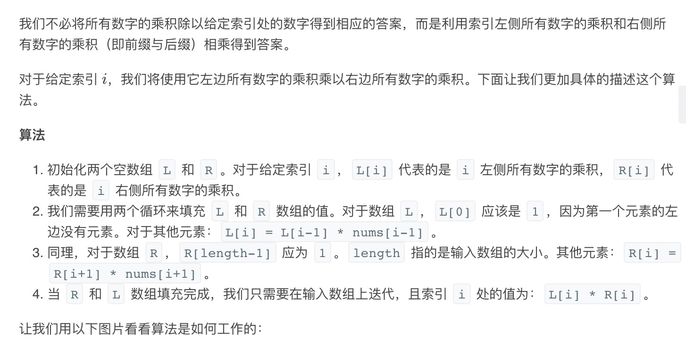
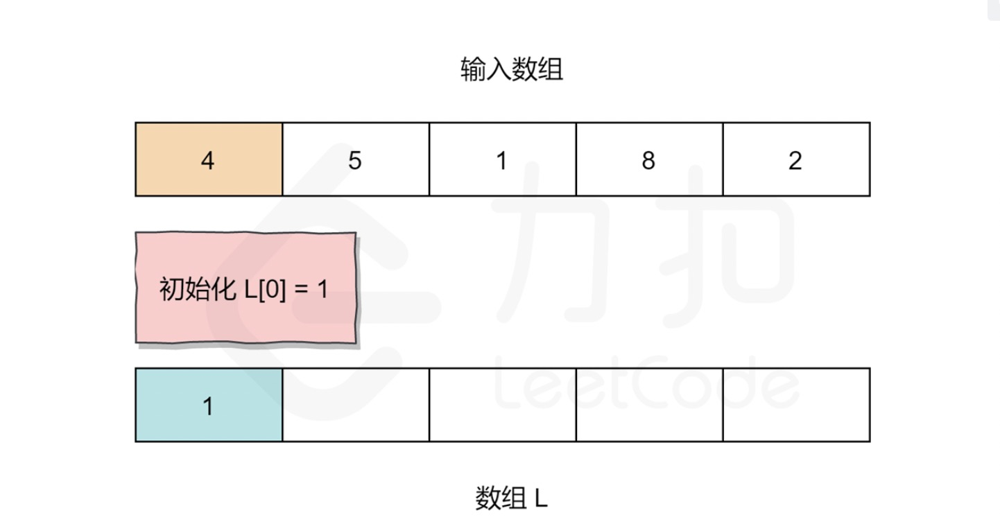
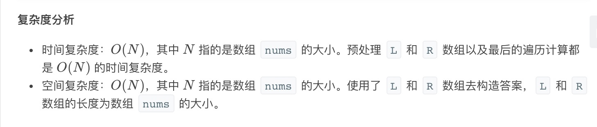
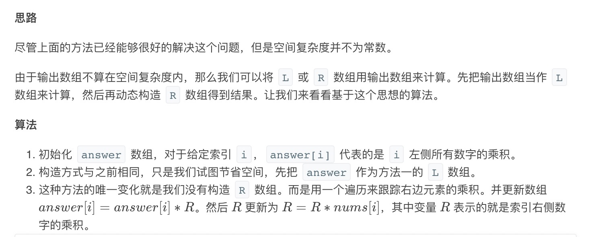

= 除自身以外数组的乘积
:toc:
:toclevels: 5
:toc-title: 目录
:sectnums:

== 说明
给你一个长度为 n 的整数数组 nums，其中 n > 1，返回输出数组 output ，其中 output[i] 等于 nums 中除 nums[i] 之外其余各元素的乘积。

 

示例:
```
输入: [1,2,3,4]
输出: [24,12,8,6]
 
```
提示：题目数据保证数组之中任意元素的全部前缀元素和后缀（甚至是整个数组）的乘积都在 32 位整数范围内。

说明: 请不要使用除法，且在 O(n) 时间复杂度内完成此题。

进阶：
```
你可以在常数空间复杂度内完成这个题目吗？（ 出于对空间复杂度分析的目的，输出数组不被视为额外空间。）

```

== 参考
https://leetcode-cn.com/problems/product-of-array-except-self/

== 题解
=== 左右乘积列表





```python
def productExceptSelf( nums: [int]) -> [int]:
    n = len(nums)
    left, right , result = [0] * n , [0] * n , [0] * n
    left[0] = 1
    right[n-1] = 1
    for i in range(1,n) :
        left[i] = left[i-1] * nums[i-1]
    for i in range(n-2,-1,-1) :
        right[i] = right[i+1] * nums[i+1]
    for i in range(n) :
        result[i] = left[i] * right[i]
    return result
```



=== 空间复杂度 O(1)O(1) 的方法


```python
def productExceptSelf(nums: [int]) -> [int]:
    n = len(nums)
    result = [0] * n
    result[0] = 1
    for i in range(1,n) :
        result[i] = result[i-1] * nums[i-1]
    tmp = 1
    for i in range(n-2,-1,-1) :
        tmp *= nums[i+1]
        result[i] = result[i] * tmp
    return result
```

复杂度:

- 时间复杂度: o(n) ,n 是数组的长度
- 空间复杂度: o(1) , 输出数组不算空间复杂度，只有tmp 临时变量

