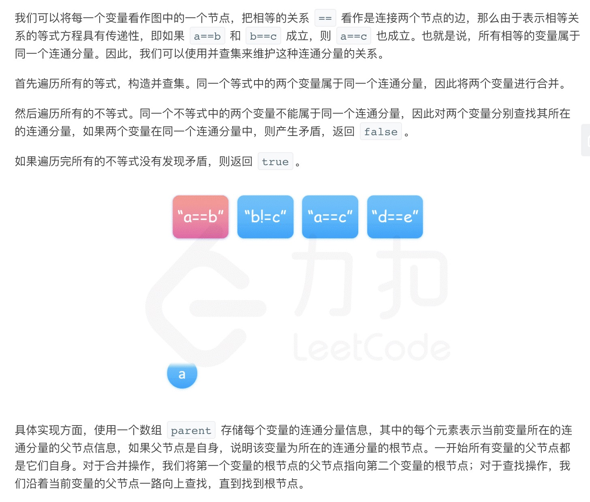
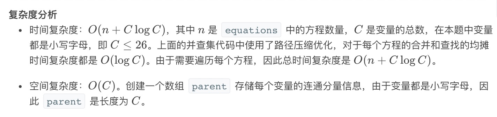

= 等式方程的可满足性
:toc:
:toc-title: 目录
:toclevels:
:sectnums:

== 题目说明
给定一个由表示变量之间关系的字符串方程组成的数组，每个字符串方程 equations[i] 的长度为 4，并采用两种不同的形式之一："a==b" 或 "a!=b"。在这里，a 和 b 是小写字母（不一定不同），表示单字母变量名。

只有当可以将整数分配给变量名，以便满足所有给定的方程时才返回 true，否则返回 false。 

 

示例 1：
```
输入：["a==b","b!=a"]
输出：false
解释：如果我们指定，a = 1 且 b = 1，那么可以满足第一个方程，但无法满足第二个方程。没有办法分配变量同时满足这两个方程。
```
示例 2：
```
输出：["b==a","a==b"]
输入：true
解释：我们可以指定 a = 1 且 b = 1 以满足满足这两个方程。
```
示例 3：
```
输入：["a==b","b==c","a==c"]
输出：true
```
示例 4：
```
输入：["a==b","b!=c","c==a"]
输出：false
```
示例 5：
```
输入：["c==c","b==d","x!=z"]
输出：true
```

== 参考
- https://leetcode-cn.com/problems/satisfiability-of-equality-equations/

== 题解
=== 并查集


```python
class Solution:
    class UnionFind:
        def __init__(self) :
            self.parent = list(range(26))

        def find(self,index) :
            if index == self.parent[index] :
                return index
            self.parent[index] = self.find(self.parent[index])
            return self.parent[index]

        def union(self,index1,index2) :
            self.parent[self.find(index1)] = self.find(index2)


    def equationsPossible(self, equations: [str]) -> bool:
        uf = self.UnionFind()
        for eq in equations :
            if eq[1] == "=" :
                index1 = ord(eq[0]) - ord("a")
                index2 = ord(eq[3]) - ord("a")
                uf.union(index1,index2)
        for eq in equations :
            if eq[1] == "!":
                index1 = ord(eq[0]) - ord("a")
                index2 = ord(eq[3]) - ord("a")
                if uf.find(index1) == uf.find(index2) :
                    return False
        return True

```



