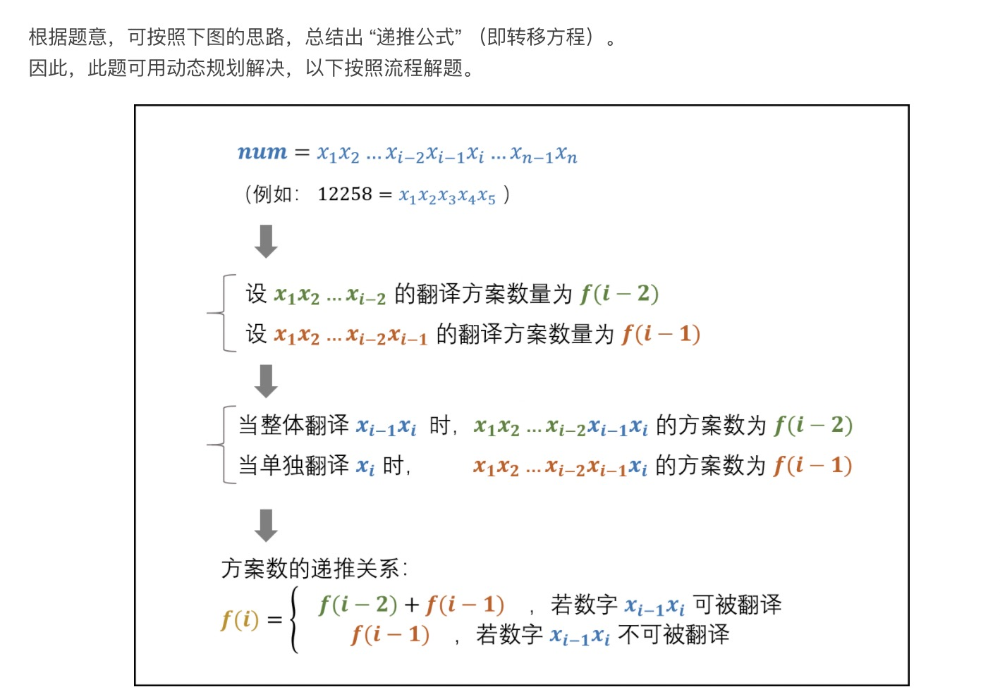
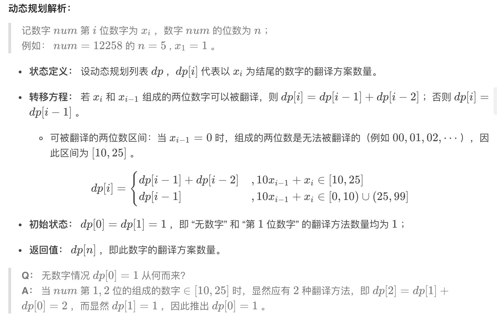
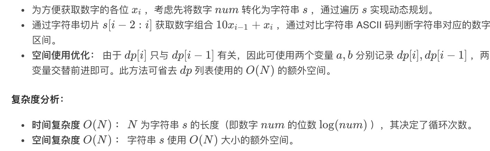
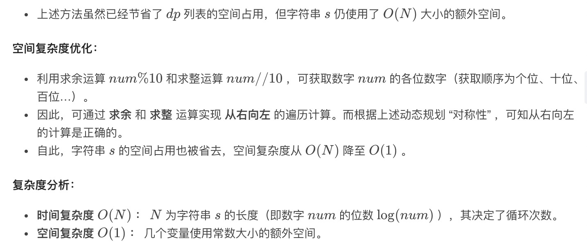

= 把数字翻译成字符串
:toc:
:toc-title: 目录
:toclevels:
:sectnums:


给定一个数字，我们按照如下规则把它翻译为字符串：0 翻译成 “a” ，1 翻译成 “b”，……，11 翻译成 “l”，……，25 翻译成 “z”。一个数字可能有多个翻译。请编程实现一个函数，用来计算一个数字有多少种不同的翻译方法。

 

示例 1:
```
输入: 12258
输出: 5
解释: 12258有5种不同的翻译，分别是"bccfi", "bwfi", "bczi", "mcfi"和"mzi"
```

提示：
```
0 <= num < 2^31
```

== 参考
https://leetcode-cn.com/problems/ba-shu-zi-fan-yi-cheng-zi-fu-chuan-lcof/

== 知识点
动态规划

== 题解
=== 字符串遍历






```python
def translateNum(num: int) -> int:
    s = str(num)
    f_1 = f_2 = 1
    for i in range(2, len(s) + 1):
        pre = s[i - 2:i]
        f = f_1 + f_2 if pre >= "10" and pre <= "25" else f_1
        f_2 = f_1
        f_1 = f
    return f_1
```

=== 动态求余法


```python
def translateNum(num: int) -> int:
    f_1 = f_2 = 1
    while num:
        pre = num % 100
        f = f_1 + f_2 if pre >= 10 and pre <= 25 else f_1
        f_2 = f_1
        f_1 = f
        num = num // 10
    return f_1
```
