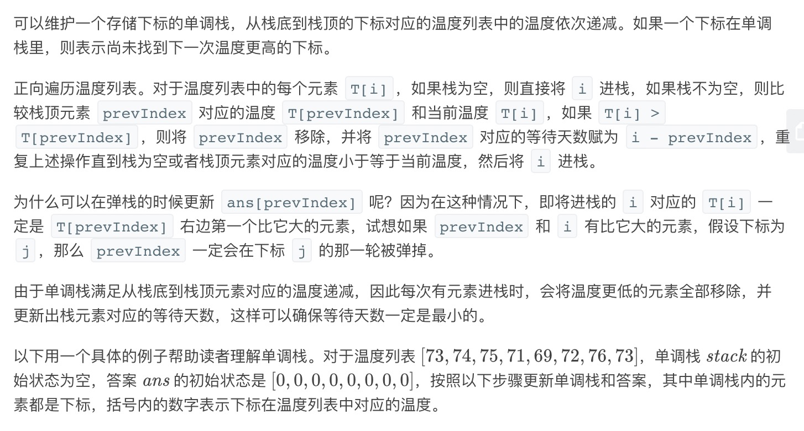
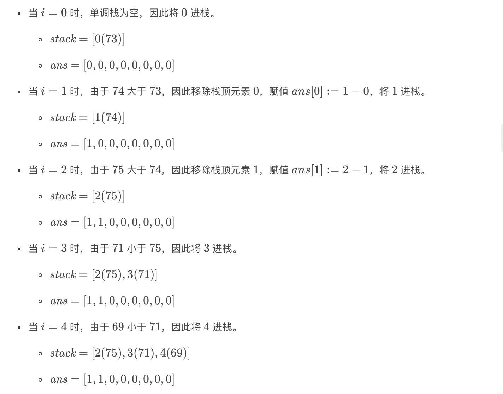
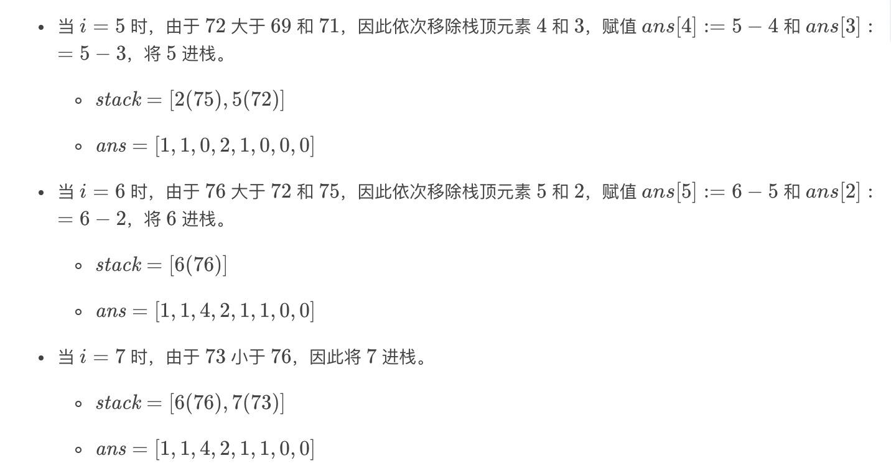

= 每日温度
:toc:
:toc-title: 目录
:toclevels:
:sectnums:

== 说明
请根据每日 气温 列表，重新生成一个列表。对应位置的输出为：要想观测到更高的气温，至少需要等待的天数。如果气温在这之后都不会升高，请在该位置用 0 来代替。

例如，给定一个列表 temperatures = [73, 74, 75, 71, 69, 72, 76, 73]，你的输出应该是 [1, 1, 4, 2, 1, 1, 0, 0]。

提示：气温 列表长度的范围是 [1, 30000]。每个气温的值的均为华氏度，都是在 [30, 100] 范围内的整数。

== 参考
https://leetcode-cn.com/problems/daily-temperatures/


== 知识点

单调栈

== 题解
=== 暴力法
两次循环解决问题,如果T很大则很耗时

```go
func dailyTemperatures(T []int) []int {
	n := len(T)
	result := make([]int, n)
	if n == 1 {
		return result
	}
	for i := 0; i < n-1; i++ {
		for j := i + 1; j < n; j++ {
			if T[j] > T[i] {
				result[i] = j - i
				break
			}
		}
	}
	return result
}
```

复杂度:

- 时间复杂度: o(n^2) ,两次循环
- 空间复杂度: o(1) ，除去结果集不需要额外的空间

=== 单调栈





```go
func dailyTemperatures(T []int) []int {
	n := len(T)
	result := make([]int, n)
	stack := []int{}
	for i := 0; i < n; i++ {
		for len(stack) != 0 && T[stack[len(stack)-1]] < T[i] {
			result[stack[len(stack)-1]] = i - stack[len(stack)-1]
			stack = stack[:len(stack)-1]
		}
		stack = append(stack, i)
	}
	return result
}
```

```python
def dailyTemperatures(T: [int]) -> [int]:
    n = len(T)
    result = [0] * n
    stack = []
    for i in range(n):
        while stack and T[stack[-1]] < T[i]:
            tmp = stack.pop()
            result[tmp] = i - tmp
        stack.append(i)
    return result
```

比较两种写法:

- python 写起来更舒服一些，尤其是栈的操作，但是耗时长和占用空间大
- 效率更好，占用空间更少

复杂度:

- 时间复杂度: O(n), 需要一次遍历
- 空间复杂度: O(n), 需要维护一个单调栈
