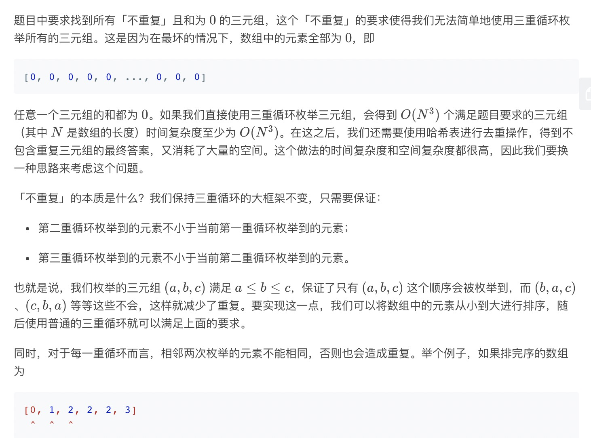
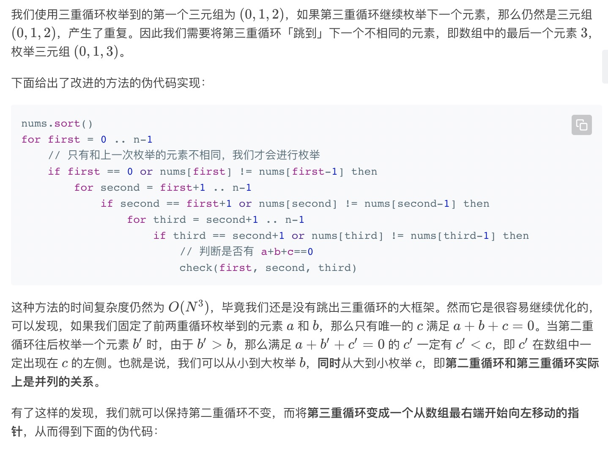
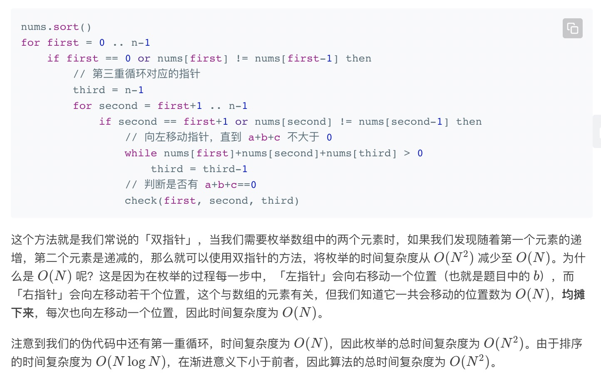

= 三数之和
:toc:
:toc-title: 目录
:toclevels: 5
:sectnums:

== 说明
给你一个包含 n 个整数的数组 nums，判断 nums 中是否存在三个元素 a，b，c ，使得 a + b + c = 0 ？请你找出所有满足条件且不重复的三元组。

注意：答案中不可以包含重复的三元组。

 

示例：

给定数组 nums = [-1, 0, 1, 2, -1, -4]，

满足要求的三元组集合为：
```
[
  [-1, 0, 1],
  [-1, -1, 2]
]
```

== 参考
https://leetcode-cn.com/problems/3sum/solution/

== 知识点
- 双指针

== 题解




```python
def threeSum(nums: [int]) -> [[int]]:
    nums.sort()
    result = []
    n = len(nums)
    if not nums or nums[0] > 0 or nums[-1] < 0 :
        return result
    for first in range(n) :
        if first > 0 and nums[first] == nums[first-1] :
            continue
        third = n-1
        target = -nums[first]
        for second in range(first+1,n) :
            if second > first + 1 and nums[second] == nums[second-1] :
                continue
            while second < third and nums[second] + nums[third] > target:
                third -= 1
            if second == third :
                break
            if nums[second] + nums[third] == target:
                result.append([nums[first],nums[second],nums[third]])
    return result

```

复杂度:

- 时间复杂度: o(N), N是数组的长度
- 空间复杂度: o(N),我们忽略存储答案的空间，额外的排序的空间复杂度为 O(logN)。然而我们修改了输入的数组nums，在实际情况下不一定允许，因此也可以看成使用了一个额外的数组存储了 nums 的副本并进行排序，空间复杂度为 O(N)

