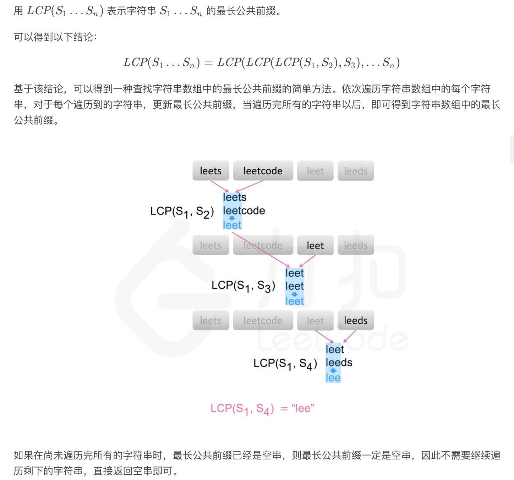
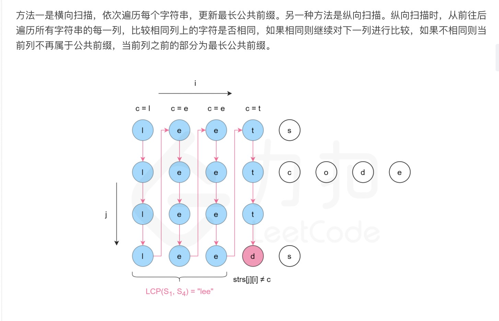
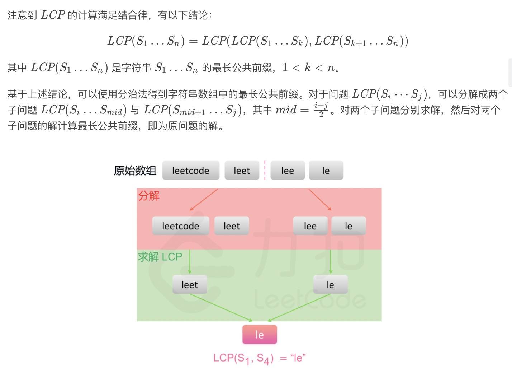

= 最长公共前缀
:toc:
:toc-title: 目录
:toclevels:
:sectnums:

== 说明
编写一个函数来查找字符串数组中的最长公共前缀。

如果不存在公共前缀，返回空字符串 ""。

示例 1:
```
输入: ["flower","flow","flight"]
输出: "fl"
```
示例 2:
```
输入: ["dog","racecar","car"]
输出: ""
解释: 输入不存在公共前缀。
```
说明:

所有输入只包含小写字母 a-z

== 参考
https://leetcode-cn.com/problems/longest-common-prefix/

== 知识点

== 题解
=== 横向扫描


```python
def longestCommonPrefix(strs: [str]) -> str:
    n = len(strs)
    result = ""
    if not n:
        return result
    result = strs[0]
    for i in range(1, n):
        result = result[:len(strs[i])]
        result_len = len(result)
        for j in range(min(len(strs[i]), result_len)):
            if result[j] != strs[i][j]:
                result = result[:j]
                break
    return result
```

复杂度:

- 时间复杂度: O(mn), 其中 m 是字符串数组中的字符串的平均长度，n 是字符串的数量。最坏情况下，字符串数组中的每个字符串的每个字符都会被比较一次。
- 空间复杂度: O(1), 使用的额外空间复杂度为常数。

=== 纵向扫描


```python
def longestCommonPrefix(strs: [str]) -> str:
    if not strs:
        return ""

    length, count = len(strs[0]), len(strs)
    for i in range(length):
        c = strs[0][i]
        if any(i == len(strs[j]) or strs[j][i] != c for j in range(1, count)):
            return strs[0][:i]

    return strs[0]
```

复杂度:

- 时间复杂度: O(mn), 其中 m 是字符串数组中的字符串的平均长度，n 是字符串的数量。最坏情况下，字符串数组中的每个字符串的每个字符都会被比较一次。
- 空间复杂度: O(1), 使用的额外空间复杂度为常数。

=== 分治


```python
    def lcp(start, end):
        if start == end:
            return strs[start]
        mid = (start + end) >> 1
        leftLcp = lcp(start, mid)
        rightLcp = lcp(mid + 1, end)
        minLcp = min(len(leftLcp), len(rightLcp))
        for i in range(minLcp):
            if leftLcp[i] != rightLcp[i]:
                return leftLcp[:i]
        return leftLcp[:minLcp]

    return lcp(0, len(strs) - 1) if strs else ""
```


=== 二分查找

