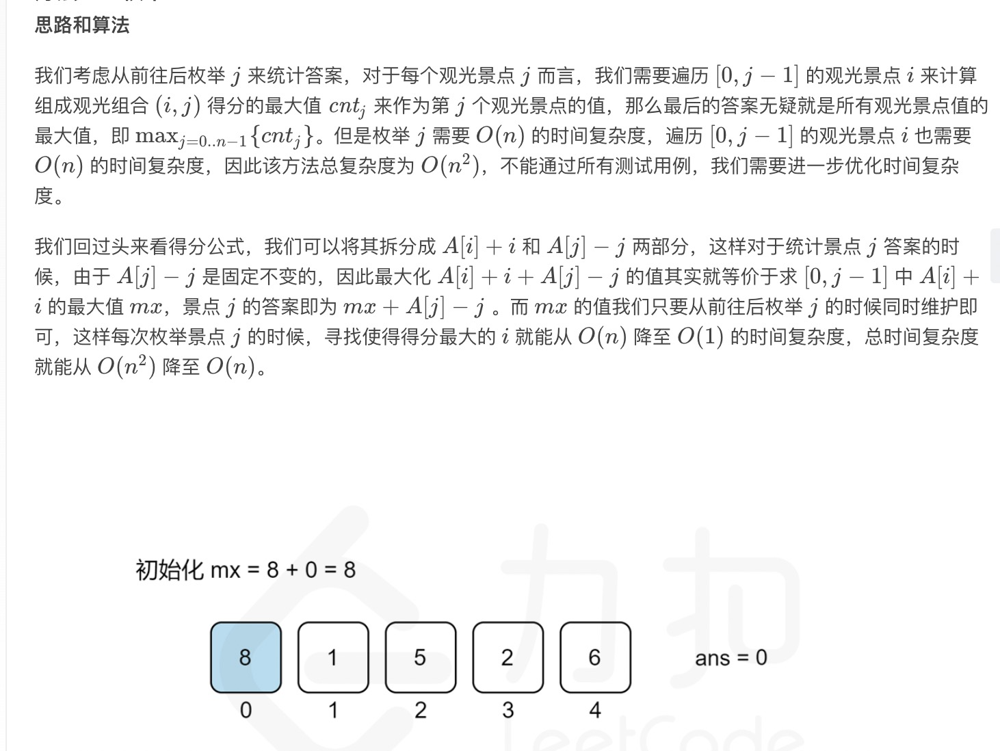

= 最佳观光组合
:toc:
:toc-title: 目录
:toclevels: 5
:sectnums:

== 说明
给定正整数数组 A，A[i] 表示第 i 个观光景点的评分，并且两个景点 i 和 j 之间的距离为 j - i。

一对景点（i < j）组成的观光组合的得分为（A[i] + A[j] + i - j）：景点的评分之和减去它们两者之间的距离。

返回一对观光景点能取得的最高分。

 

示例：
```
输入：[8,1,5,2,6]
输出：11
解释：i = 0, j = 2, A[i] + A[j] + i - j = 8 + 5 + 0 - 2 = 11
 
```
提示：
```
2 <= A.length <= 50000
1 <= A[i] <= 1000
```

== 参考
https://leetcode-cn.com/problems/best-sightseeing-pair/

== 题解

=== 暴力
最直观的解法，两层循环暴力求解

```go
func maxScoreSightseeingPair(A []int) int {
	result := 0
	n := len(A)
	for i := 0; i < n; i++ {
		for j := i + 1; j < n; j++ {
			tmp := A[i] + A[j] + i - j
			if tmp > result {
				result = tmp
			}
		}
	}
	return result
}
```

复杂度:

- 时间复杂度: o(n^2) ,两层循环
- 空间复杂度: o(1)

=== 暴力优化(一次循环)


```go
func maxScoreSightseeingPair(A []int) int {
	result := 0
	mx := A[0]
	for j := 1; j < len(A); j++ {
		if A[j]-j+mx > result {
			result = A[j] - j + mx
		}
		if A[j]+j > mx {
			mx = A[j] + j
		}
	}
	return result
}
```

复杂度:

- 时间复杂度: o(n) ,一次循环
- 空间复杂度: o(1)
