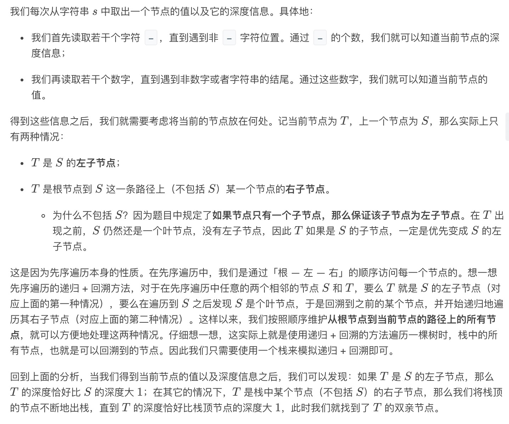
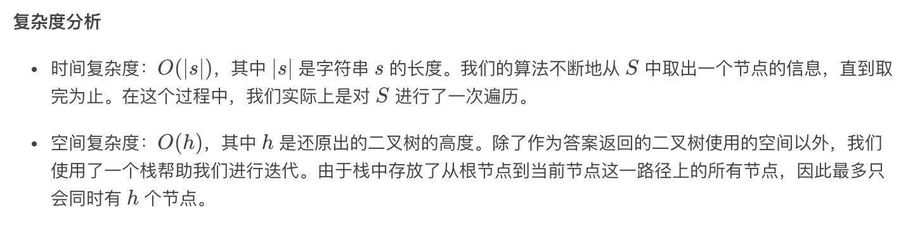

= 从先序遍历还原二叉树
:toc:
:toc-title: 目录
:toclevels: 5
:sectnums:

== 说明
我们从二叉树的根节点 root 开始进行深度优先搜索。

在遍历中的每个节点处，我们输出 D 条短划线（其中 D 是该节点的深度），然后输出该节点的值。（如果节点的深度为 D，则其直接子节点的深度为 D + 1。根节点的深度为 0）。

如果节点只有一个子节点，那么保证该子节点为左子节点。

给出遍历输出 S，还原树并返回其根节点 root。

示例 1：

image:images/1.png[]

输入："1-2--3--4-5--6--7"
输出：[1,2,5,3,4,6,7]

示例 2：

image:images/2.png[]

输入："1-2--3---4-5--6---7"
输出：[1,2,5,3,null,6,null,4,null,7]

示例 3：

image:images/3.png[]

输入："1-401--349---90--88"
输出：[1,401,null,349,88,90]

== 参考
https://leetcode-cn.com/problems/recover-a-tree-from-preorder-traversal/

== 题解


```python
def recoverFromPreorder(S: str) -> TreeNode:
    if not S:
        return None
    stack, pos = list(), 0
    while pos < len(S):
        level = 0
        while S[pos] == "-":
            pos += 1
            level += 1
        value = 0
        while pos < len(S) and S[pos].isdigit():
            value = value * 10 + int(S[pos])
            pos += 1
        node = TreeNode(value)
        if level == len(stack):
            if stack:
                stack[-1].left = node
        else:
            stack = stack[:level]
            stack[-1].right = node
        stack.append(node)
    return stack[0]
```


