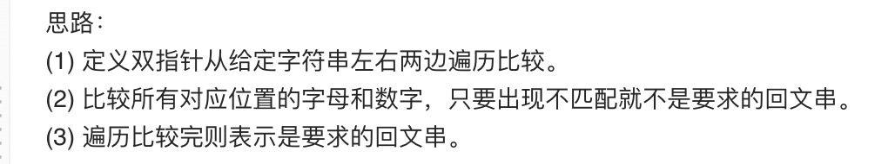

= 验证回文串
:toc:
:toc-title: 目录
:toclevels: 5
:sectnums:

== 说明
给定一个字符串，验证它是否是回文串，只考虑字母和数字字符，可以忽略字母的大小写。

说明：本题中，我们将空字符串定义为有效的回文串。

示例 1:
```
输入: "A man, a plan, a canal: Panama"
输出: true
```
示例 2:
```
输入: "race a car"
输出: false
```

== 参考
https://leetcode-cn.com/problems/valid-palindrome/

== 知识点
双指针

== 题解
=== 双指针


```python
def isPalindrome(s: str) -> bool:
    if not s:
        return True
    i, j = 0, len(s) - 1
    while i <= j:
        if not ((s[i] >= "a" and s[i] <= "z") or (s[i] >= "A" and s[i] <= "Z") or (s[i] >= "0") and s[i] <= "9"):
            i += 1
            continue
        if not ((s[j] >= "a" and s[j] <= "z") or (s[j] >= "A" and s[j] <= "Z") or (s[j] >= "0") and s[j] <= "9"):
            j -= 1
            continue
        if s[i].lower() != s[j].lower():
            return False
        i += 1
        j -= 1
    return True
```

```go
func isPalindrome(s string) bool {
	if len(s) == 0 {
		return true
	}
	i, j := 0, len(s)-1
	for i <= j {
		if !((s[i] >= 'a' && s[i] <= 'z') || (s[i] >= 'A' && s[i] <= 'Z') || (s[i] >= '0' && s[i] <= '9')) {
			i++
			continue
		}
		if !((s[j] >= 'a' && s[j] <= 'z') || (s[j] >= 'A' && s[j] <= 'Z') || (s[j] >= '0' && s[j] <= '9')) {
			j--
			continue
		}
		if strings.ToLower(string(s[i])) != strings.ToLower(string(s[j])) {
			return false
		}
		i++
		j--
	}
	return true
}
```

复杂度:

- 时间复杂度: O(n) ,需要一次遍历
- 空间复杂度: O(1)
