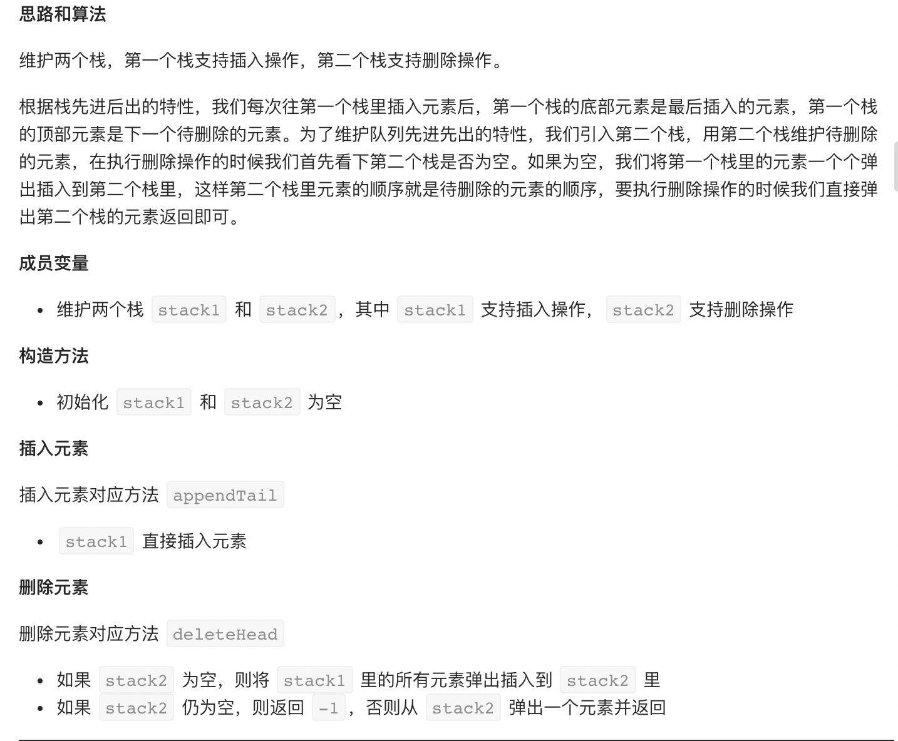
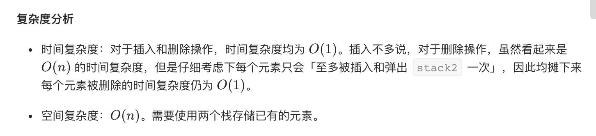

= 用两个栈实现队列
:toc:
:toclevels: 5
:toc-title: 目录
:sectnums:

== 说明
用两个栈实现一个队列。队列的声明如下，请实现它的两个函数 appendTail 和 deleteHead ，分别完成在队列尾部插入整数和在队列头部删除整数的功能。(若队列中没有元素，deleteHead 操作返回 -1 )

示例 1：
```
输入：
["CQueue","appendTail","deleteHead","deleteHead"]
[[],[3],[],[]]
输出：[null,null,3,-1]
```
示例 2：
```
输入：
["CQueue","deleteHead","appendTail","appendTail","deleteHead","deleteHead"]
[[],[],[5],[2],[],[]]
输出：[null,-1,null,null,5,2]
```

== 参考
- https://leetcode-cn.com/problems/yong-liang-ge-zhan-shi-xian-dui-lie-lcof/

== 知识点
- stack 栈先进先出

== 题解


```python
class CQueue:

    def __init__(self):
        self.stack_in = []
        self.stack_out = []


    def appendTail(self, value: int) -> None:
        self.stack_in.append(value)


    def deleteHead(self) -> int:
        if len(self.stack_out) == 0 :
            while self.stack_in :
                self.stack_out.append(self.stack_in.pop())
        if len(self.stack_out) != 0 :
            return self.stack_out.pop()
        return -1

# obj = CQueue()
# obj.appendTail(value)
# param_2 = obj.deleteHead()
```



