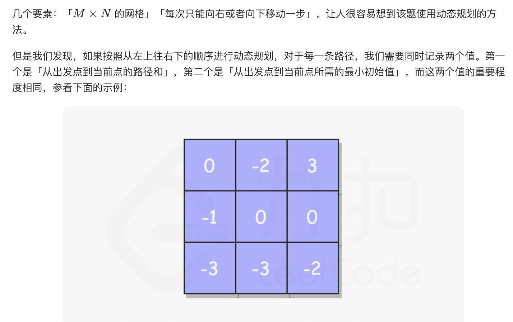
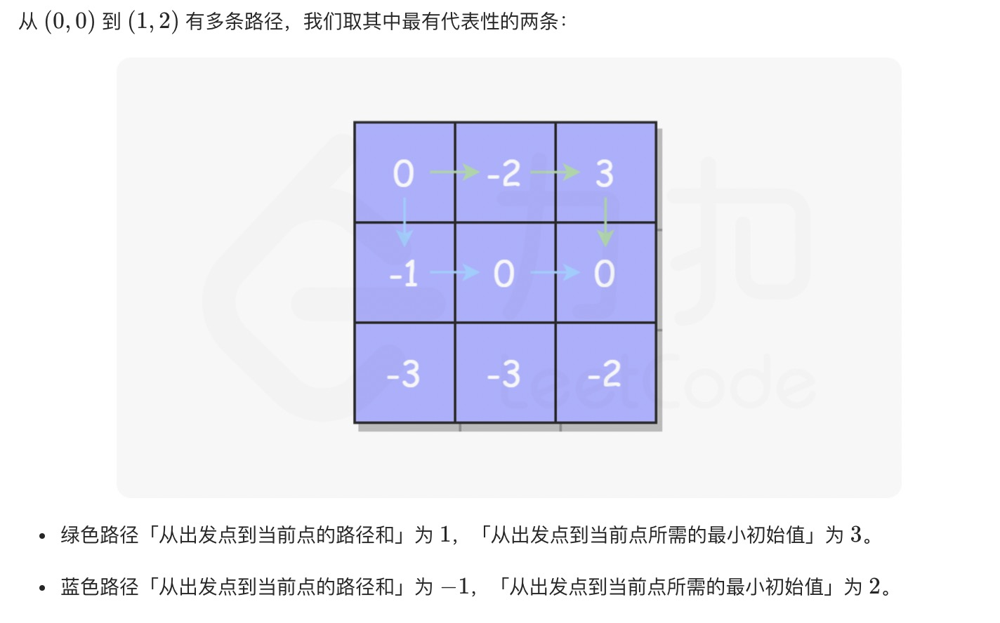
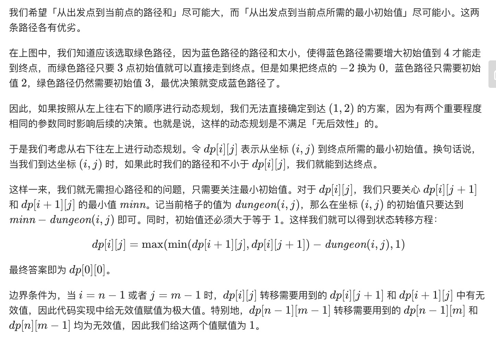

= 地下城游戏
:toc:
:toc-title:
:toclevels: 5
:sectnums:

== 说明
一些恶魔抓住了公主（P）并将她关在了地下城的右下角。地下城是由 M x N 个房间组成的二维网格。我们英勇的骑士（K）最初被安置在左上角的房间里，他必须穿过地下城并通过对抗恶魔来拯救公主。

骑士的初始健康点数为一个正整数。如果他的健康点数在某一时刻降至 0 或以下，他会立即死亡。

有些房间由恶魔守卫，因此骑士在进入这些房间时会失去健康点数（若房间里的值为负整数，则表示骑士将损失健康点数）；其他房间要么是空的（房间里的值为 0），要么包含增加骑士健康点数的魔法球（若房间里的值为正整数，则表示骑士将增加健康点数）。

为了尽快到达公主，骑士决定每次只向右或向下移动一步。

 

编写一个函数来计算确保骑士能够拯救到公主所需的最低初始健康点数。

例如，考虑到如下布局的地下城，如果骑士遵循最佳路径 右 -> 右 -> 下 -> 下，则骑士的初始健康点数至少为 7。
```
-2 (K)	-3	3
-5	-10	1
10	30	-5 (P)
```

说明:

骑士的健康点数没有上限。

任何房间都可能对骑士的健康点数造成威胁，也可能增加骑士的健康点数，包括骑士进入的左上角房间以及公主被监禁的右下角房间。

== 参考
- https://leetcode-cn.com/problems/dungeon-game/

== 知识点
- 动态规划

== 题解
=== 动态规划






```python
def calculateMinimumHP(dungeon: [[int]]) -> int:
    m = len(dungeon)
    n = len(dungeon[0])
    dp = [ [float("inf")] * (n+1) for _ in range(m+1)]
    dp[m-1][n] = dp[m][n-1] = 1
    for i in range(m-1,-1,-1) :
        for j in range(n-1,-1,-1) :
            dp[i][j] = max(min(dp[i+1][j], dp[i][j+1])-dungeon[i][j],1)
    return dp[0][0]
```


