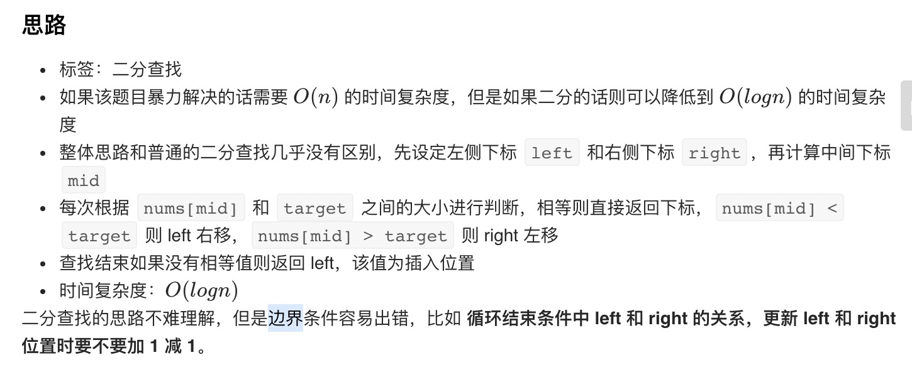

= 搜索插入位置
:toc:
:toclevels:
:sectnums:
:toc-title:

== 说明
给定一个排序数组和一个目标值，在数组中找到目标值，并返回其索引。如果目标值不存在于数组中，返回它将会被按顺序插入的位置。

你可以假设数组中无重复元素。

示例 1:
```
输入: [1,3,5,6], 5
输出: 2
```
示例 2:
```
输入: [1,3,5,6], 2
输出: 1
```
示例 3:
```
输入: [1,3,5,6], 7
输出: 4
```
示例 4:
```
输入: [1,3,5,6], 0
输出: 0
```
== 参考
- https://leetcode-cn.com/problems/search-insert-position/

== 知识点
- 二分法

== 题解
=== 二分法


```go
func searchInsert(nums []int, target int) int {
    if len(nums) == 0 {
        return 0
    }
    left := 0
    right := len(nums) - 1
    for left <= right {
        mid := (left + right) >> 1
        if nums[mid] == target {
            return mid
        }
        if nums[mid] > target {
            right = mid -1
        } else {
            left = mid + 1
        }
    }
    return left
}
```

复杂度:

- 时间复杂度: o(log*n)
- 空间复杂度: o(1)