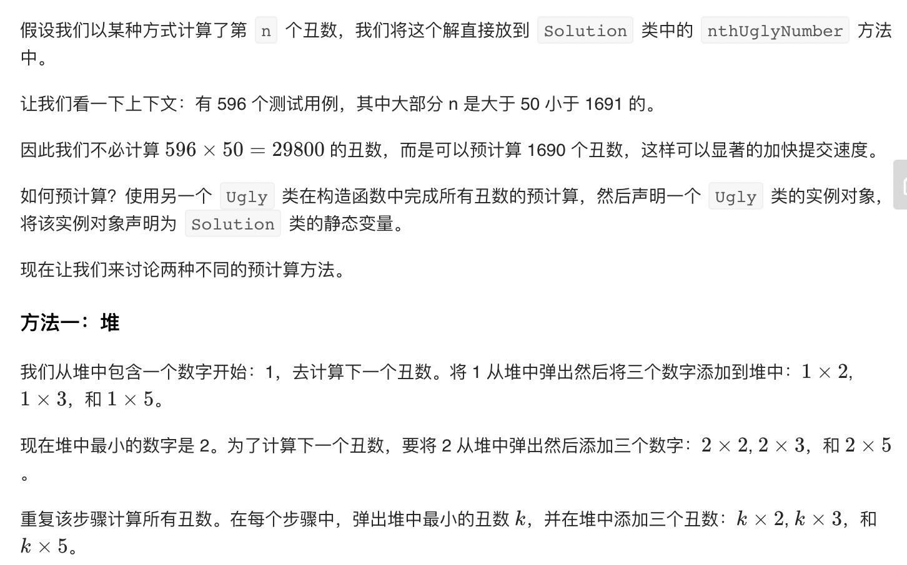
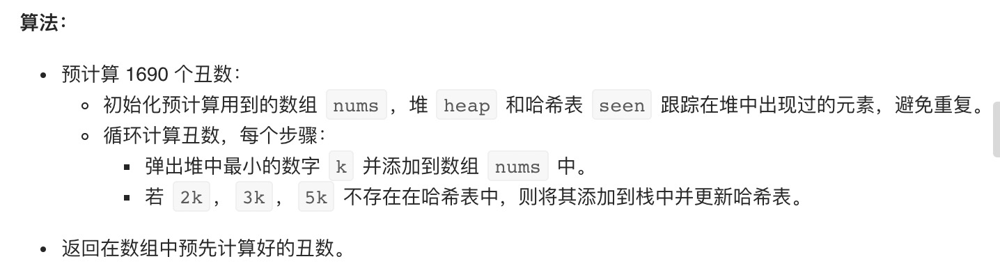
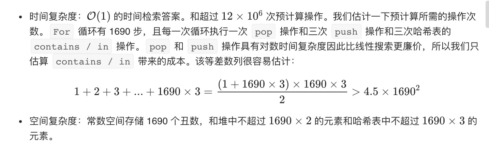
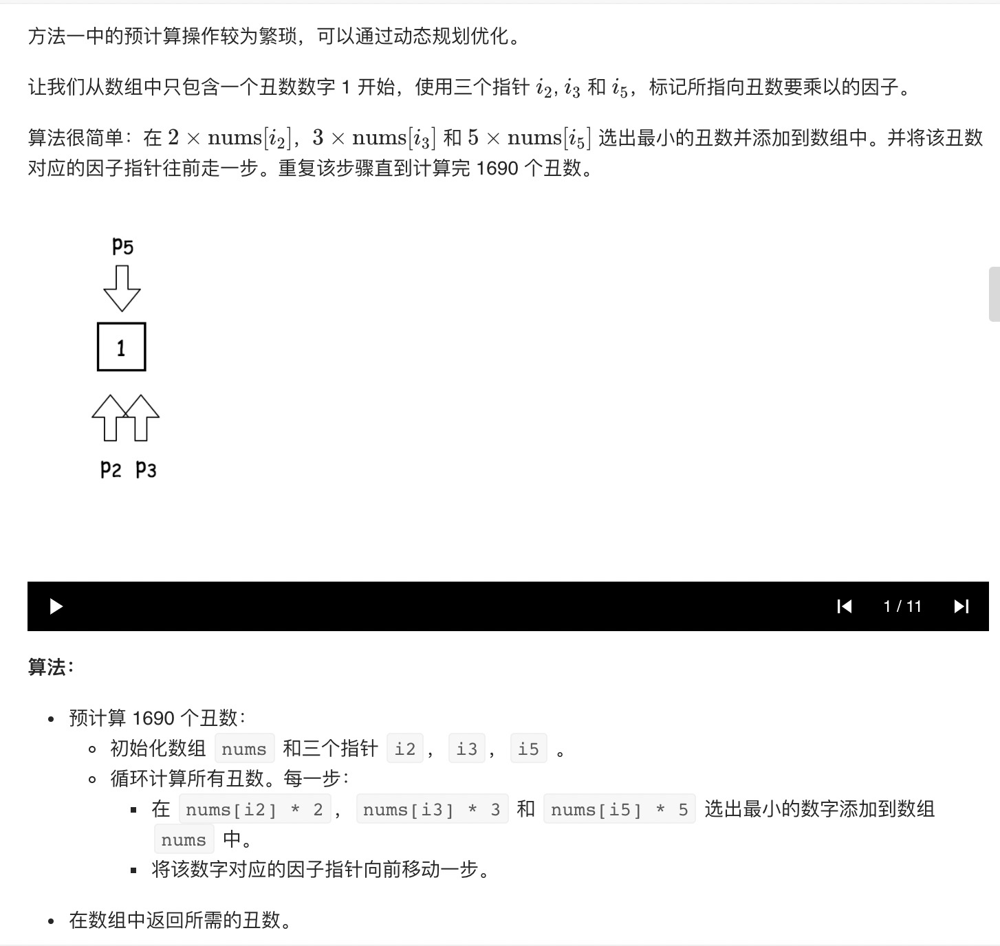
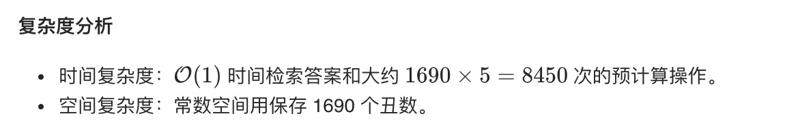

= 丑数 II
编写一个程序，找出第 n 个丑数。

丑数就是质因数只包含 2, 3, 5 的正整数。

示例:
```
输入: n = 10
输出: 12
解释: 1, 2, 3, 4, 5, 6, 8, 9, 10, 12 是前 10 个丑数。
说明:  

1 是丑数。
n 不超过1690。
```

== 参考
- https://leetcode-cn.com/problems/ugly-number-ii/

== 知识点
- 堆
- 动态规划

== 题解
=== 堆




```python
import heapq

class Ugly:
    def __init__(self) :
        # seen 用于记录有没有遍历过，也可以用heap 代替，但是效率低很多
        seen = {1,}
        self.nums = []
        heap = [1]
        for _ in range(1690) :
            current_num = heapq.heappop(heap)
            self.nums.append(current_num)
            for i in [2,3,5] :
                heap_num = current_num * i
                if heap_num not in seen :
                    seen.add(heap_num)
                    heapq.heappush(heap,heap_num)

class Solution:
    def nthUglyNumber(self, n: int) -> int:
        u = Ugly()
        return u.nums[n-1]
```



=== 动态规划


```python
class Ugly:
    def __init__(self) :
        self.nums = [1]
        i2 = i3 = i5 = 0
        for i in range(1690) :
            ugly = min(self.nums[i2] * 2, self.nums[i3] * 3, self.nums[i5] * 5)
            self.nums.append(ugly)
            if ugly == self.nums[i2] * 2 :
                i2 += 1
            if ugly == self.nums[i3] * 3 :
                i3 += 1
            if ugly == self.nums[i5] * 5 :
                i5 += 1

class Solution:
    u = Ugly()
    def nthUglyNumber(self, n: int) -> int:
        return self.u.nums[n-1]
```


