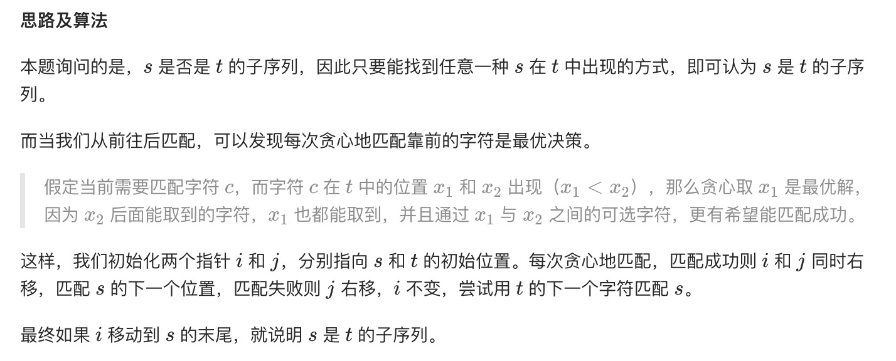
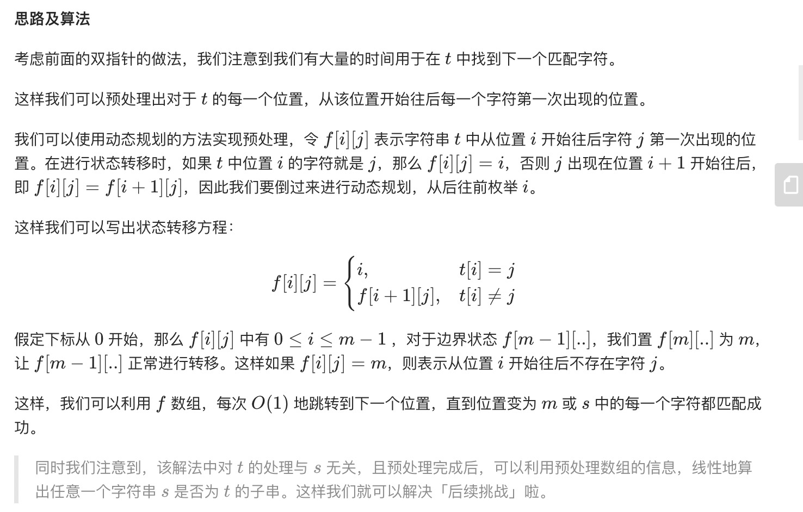

= 判断子序列
:toc:
:toclevels: 5
:toc-title:
:sectnums:

== 说明
给定字符串 s 和 t ，判断 s 是否为 t 的子序列。

你可以认为 s 和 t 中仅包含英文小写字母。字符串 t 可能会很长（长度 ~= 500,000），而 s 是个短字符串（长度 <=100）。

字符串的一个子序列是原始字符串删除一些（也可以不删除）字符而不改变剩余字符相对位置形成的新字符串。（例如，"ace"是"abcde"的一个子序列，而"aec"不是）。

示例 1:
```
s = "abc", t = "ahbgdc"

返回 true.
```
示例 2:
```
s = "axc", t = "ahbgdc"

返回 false.
```

== 参考
- https://leetcode-cn.com/problems/is-subsequence/

== 知识点
- 双指针
- 动态规划

== 题解
=== 双指针


```python
def isSubsequence(s: str, t: str) -> bool:
    """
    原始版
    :param s:
    :param t:
    :return:
    """
    if len(s) > len(t):
        return False
    if s == t:
        return True
    i, j = 0, 0
    while i < len(s) and j < len(t):
        if s[i] == t[j]:
            i += 1
            j += 1
            if i == len(s):
                return True
        else:
            j += 1
    return False

def isSubsequence_optimize(s: str, t: str) -> bool:
    """

    :param s:
    :param t:
    :return:
    """
    m ,n = len(s) , len(t)
    i = j = 0
    while i < m and j < n :
        if s[i] == t[j] :
            i += 1
        j += 1
    return i == m

```


复杂度分析

- 时间复杂度：O(n+m)，其中 n 为 s 的长度，m 为 t 的长度。每次无论是匹配成功还是失败，都有至少一个指针发生右移，两指针能够位移的总距离为 n+m。
- 空间复杂度：O(1)。

=== 动态规划

