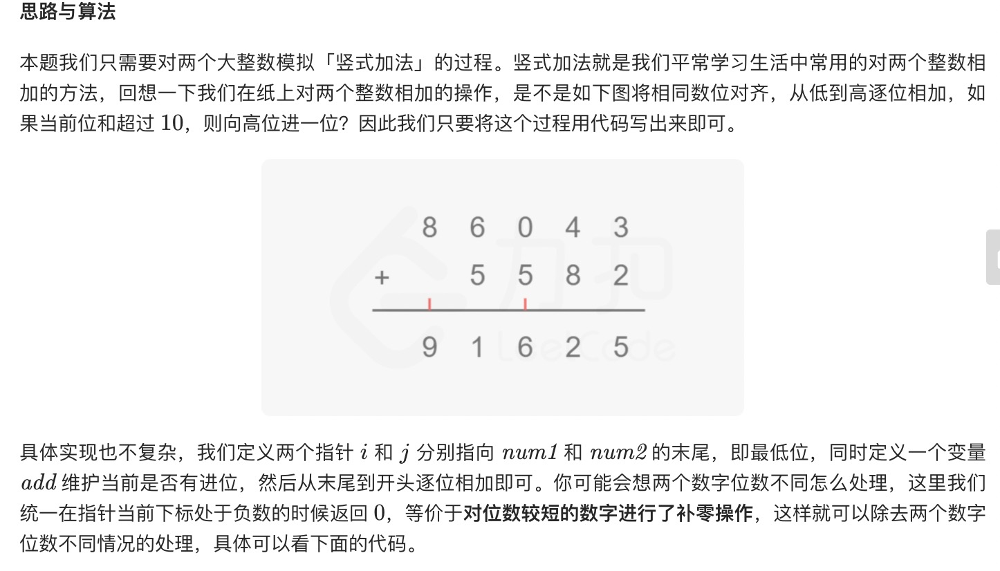
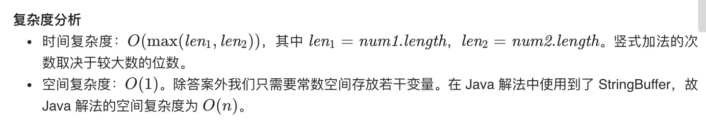

= 字符串相加
:toc:
:toclevels: 5
:toc-title:
:sectnums:

== 说明
给定两个字符串形式的非负整数 num1 和num2 ，计算它们的和。

 

提示：

- num1 和num2 的长度都小于 5100
- num1 和num2 都只包含数字 0-9
- num1 和num2 都不包含任何前导零
- 你不能使用任何內建 BigInteger 库， 也不能直接将输入的字符串转换为整数形式

== 参考
- https://leetcode-cn.com/problems/add-strings/

== 题解


```python
def addStrings(num1: str, num2: str) -> str:
    i, j = len(num1) - 1, len(num2) - 1
    tmp = 0
    result = ""
    while i >= 0 or j >= 0:
        if i >= 0:
            tmp += int(num1[i])
            i -= 1
        if j >= 0:
            tmp += int(num2[j])
            j -= 1
        result = str(tmp % 10) + result
        tmp //= 10
    if tmp != 0:
        result = str(tmp) + result
    return result
```



