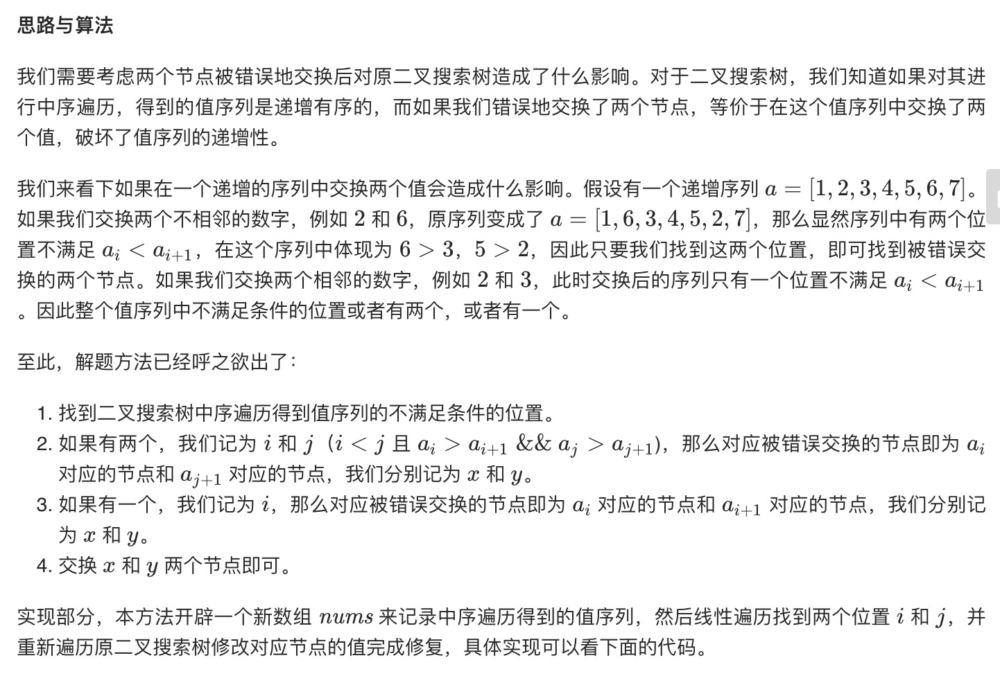

= 恢复二叉搜索树
:toc:
:toc-title:
:toclevels: 5
:sectnums:

== 说明
二叉搜索树中的两个节点被错误地交换。

请在不改变其结构的情况下，恢复这棵树。

示例 1:
```
输入: [1,3,null,null,2]

   1
  /
 3
  \
   2

输出: [3,1,null,null,2]

   3
  /
 1
  \
   2
```
示例 2:
```
输入: [3,1,4,null,null,2]

  3
 / \
1   4
   /
  2

输出: [2,1,4,null,null,3]

  2
 / \
1   4
   /
  3
```
进阶:

- 使用 O(n) 空间复杂度的解法很容易实现。
- 你能想出一个只使用常数空间的解决方案吗？

== 参考
- https://leetcode-cn.com/problems/recover-binary-search-tree/

== 题解
=== 显式中序遍历



```go
func recoverTree(root *TreeNode) {
	nums := []int{}
	var inorder func(root *TreeNode)
	inorder = func(root *TreeNode) {
		if root == nil {
			return
		}
		inorder(root.Left)
		nums = append(nums, root.Val)
		inorder(root.Right)
	}
	inorder(root)
	x, y := findNum(nums)
	revover(root, 2, x, y)

}

func findNum(nums []int) (int, int) {
	x, y := -1, -1
	for i := 0; i < len(nums)-1; i++ {
		if nums[i+1] < nums[i] {
			y = nums[i+1]
			if x == -1 {
				x = nums[i]
			} else {
				break
			}
		}
	}
	return x, y
}

func revover(root *TreeNode, count, x, y int) {
	if root == nil || count == 0 {
		return
	}
	if root.Val == x || root.Val == y {
		if root.Val == x {
			root.Val = y
		} else {
			root.Val = x
		}
		count--
	}
	revover(root.Left, count, x, y)
	revover(root.Right, count, x, y)
}
```


=== 隐式中序遍历


```go
func recoverTree(root *TreeNode) {
	stack := []*TreeNode{}
	var x, y, pre *TreeNode
	for len(stack) > 0 || root != nil {
		for root != nil {
			stack = append(stack, root)
			root = root.Left
		}
		root = stack[len(stack)-1]
		stack = stack[:len(stack)-1]
		if pre != nil && root.Val < pre.Val {
			y = root
			if x == nil {
				x = pre
			} else {
				break
			}
		}
		pre = root
		root = root.Right
	}
	x.Val, y.Val = y.Val, x.Val
}
```


=== Morris 中序遍历

