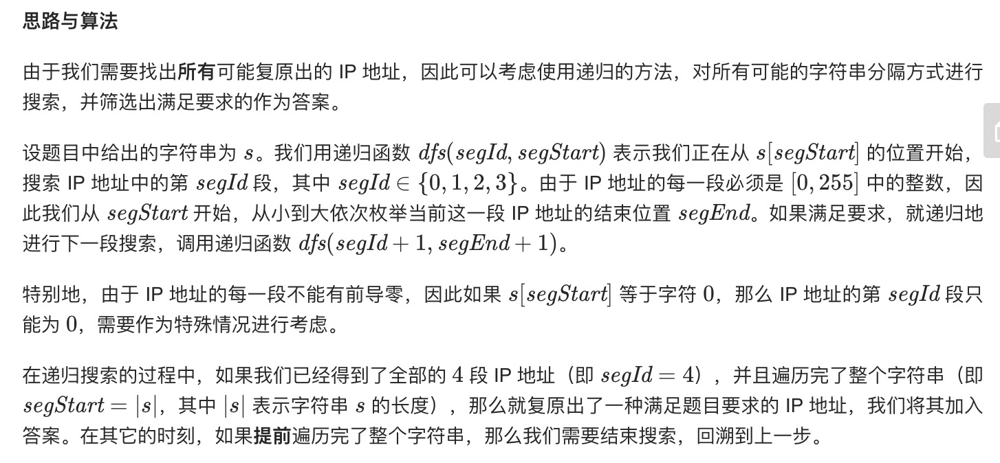
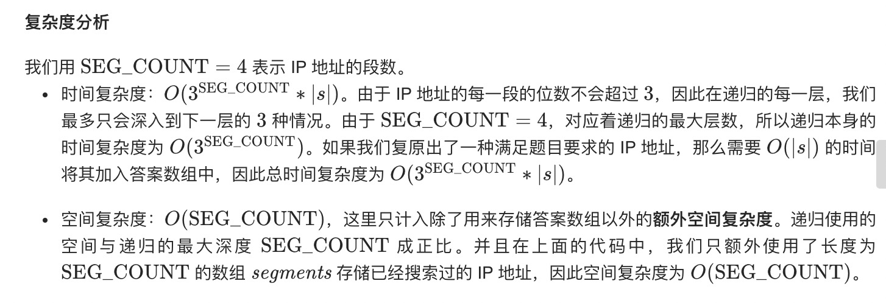

= 复原IP地址
:toc:
:toclevels: 5
:toc-title:
:sectnums:

== 说明
给定一个只包含数字的字符串，复原它并返回所有可能的 IP 地址格式。

有效的 IP 地址正好由四个整数（每个整数位于 0 到 255 之间组成），整数之间用 '.' 分隔。

示例:
```
输入: "25525511135"
输出: ["255.255.11.135", "255.255.111.35"]

```

== 参考
- https://leetcode-cn.com/problems/restore-ip-addresses/

== 题解
=== 递归



```go
const (
	SIG_COUNT = 4
)

var (
	result   []string
	sigments []int
)

func restoreIpAddresses(s string) []string {
	result = []string{}
	sigments = make([]int, SIG_COUNT)
	dfs(s, 0, 0)
	return result
}

func dfs(s string, sigId, sigStart int) {
	if sigId == SIG_COUNT {
		if sigStart == len(s) {
			addr1 := ""
			for i := 0; i < SIG_COUNT; i++ {
				addr1 += strconv.Itoa(sigments[i])
				addr1 += "."
			}
			addr1 = addr1[:len(addr1)-1]
			result = append(result, addr1)
		}
		return
	}
	// 提前回溯
	if sigStart == len(s) {
		return
	}
	// 前导数字为0的情况
	if s[sigStart] == '0' {
		sigments[sigId] = 0
		dfs(s, sigId+1, sigStart+1)
	}
	addr := 0
	for sigEnd := sigStart; sigEnd < len(s); sigEnd++ {
		addr = addr*10 + int(s[sigEnd]-'0')
		if addr > 0 && addr <= 0xFF {
			sigments[sigId] = addr
			dfs(s, sigId+1, sigEnd+1)
		} else {
			break
		}
	}
}
```

