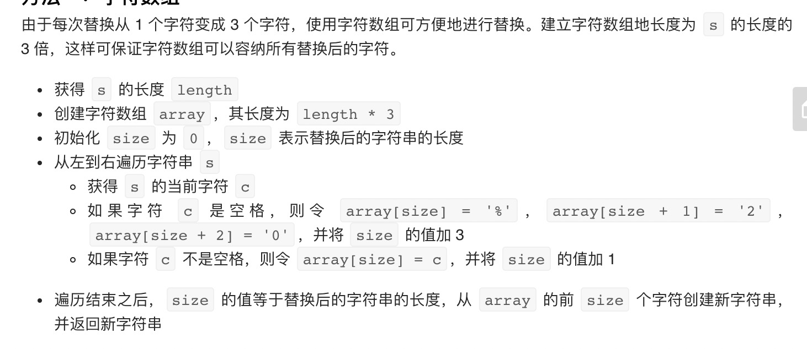

= 替换空格
:toc:
:toclevels: 5
:toc-title:
:sectnums:

== 说明
请实现一个函数，把字符串 s 中的每个空格替换成"%20"。

 

示例 1：
```
输入：s = "We are happy."
输出："We%20are%20happy."
```

限制：

0 <= s 的长度 <= 10000


== 参考
- https://leetcode-cn.com/problems/ti-huan-kong-ge-lcof/


== 题解



```go
func replaceSpace(s string) string {
    n := len(s)
    bs := make([]byte,n * 3)
    size := 0
    for i := 0 ; i < n ; i ++ {
        if s[i] == ' ' {
            bs[size] = '%'
            bs[size+1] = '2'
            bs[size+2] = '0'
            size += 3
        } else {
            bs[size] = s[i]
            size ++
        }
    }
    return string(bs[:size])
}
```

复杂性分析

- 时间复杂度：O(n)。遍历字符串 s 一遍。
- 空间复杂度：O(n)。额外创建字符数组，长度为 s 的长度的 3 倍。