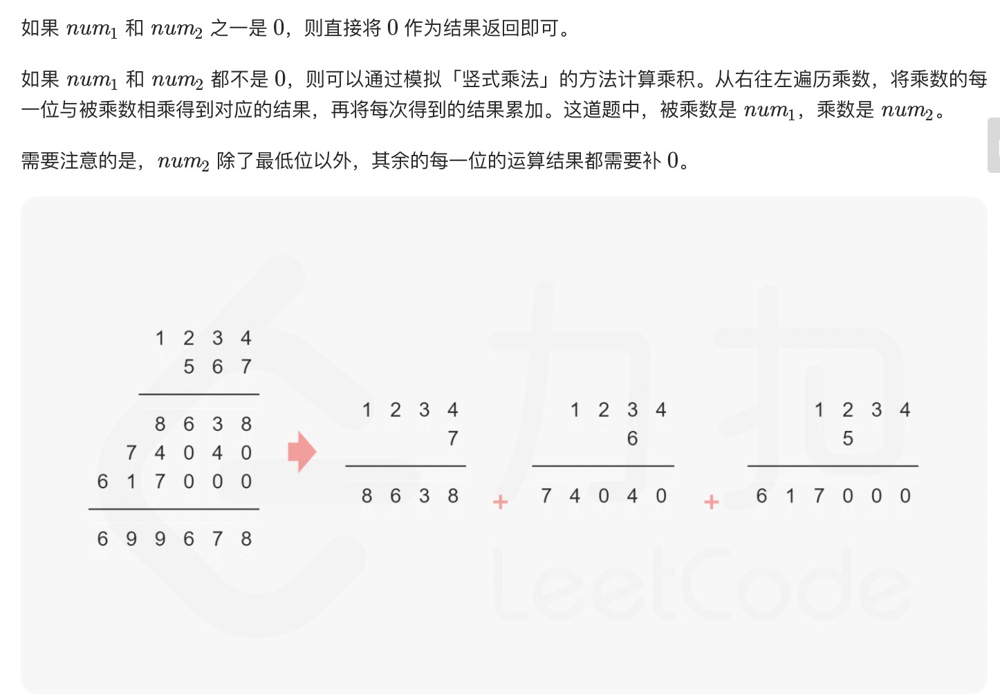
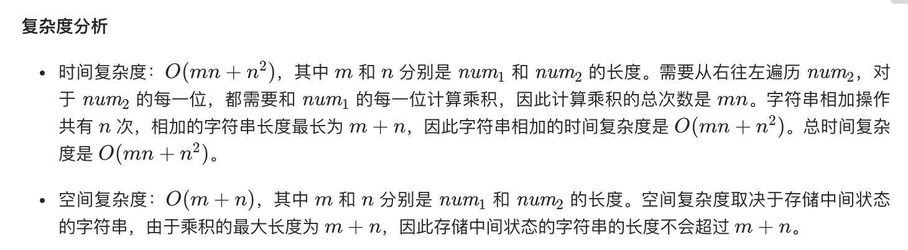
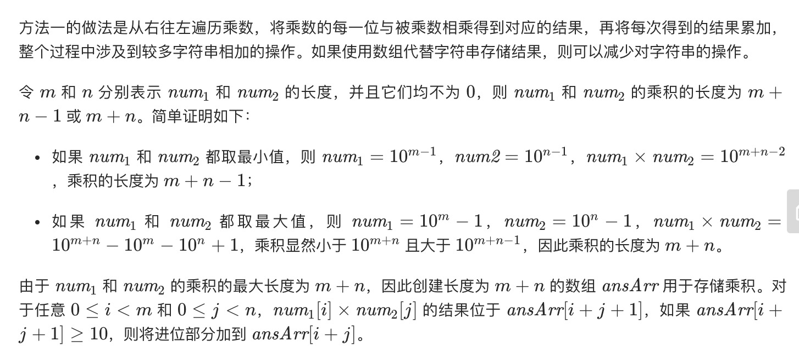
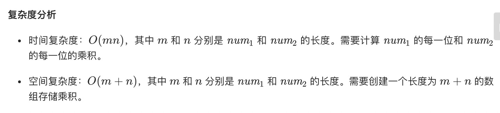

= 字符串相乘
:toc:
:toc-title:
:toclevels:
:sectnums:

== 说明
给定两个以字符串形式表示的非负整数 num1 和 num2，返回 num1 和 num2 的乘积，它们的乘积也表示为字符串形式。

示例 1:
```
输入: num1 = "2", num2 = "3"
输出: "6"
```
示例 2:
```
输入: num1 = "123", num2 = "456"
输出: "56088"
```
说明：

- num1 和 num2 的长度小于110。
- num1 和 num2 只包含数字 0-9。
- num1 和 num2 均不以零开头，除非是数字 0 本身。
- 不能使用任何标准库的大数类型（比如 BigInteger）或直接将输入转换为整数来处理。

== 参考
- https://leetcode-cn.com/problems/multiply-strings/

== 题解
=== 做加法


```go
func multiply(num1 string, num2 string) string {
	if num1 == "0" || num2 == "0" {
		return "0"
	}
	result := "0"
	for j := len(num2) - 1; j >= 0; j-- {
		jin := 0
		he := ""
		for i := len(num1) - 1; i >= 0; i-- {
			item := int(num1[i]-'0')*int(num2[j]-'0') + jin

			he = strconv.Itoa(item%10) + he
			jin = item / 10
		}
		if jin != 0 {
			he = strconv.Itoa(jin) + he
		}
		he = add0(he, len(num2)-1-j)
		result = addStrings(result, he)
	}
	return result
}

func add0(he string, index int) string {
	for i := 0; i < index; i++ {
		he += "0"
	}
	return he
}

func addStrings(num1 string, num2 string) string {
	i, j, add := len(num1)-1, len(num2)-1, 0
	result := ""
	for i >= 0 || j >= 0 {
		if i >= 0 {
			add += int(num1[i] - '0')
			i--
		}
		if j >= 0 {
			add += int(num2[j] - '0')
			j--
		}
		result = strconv.Itoa(add%10) + result
		add /= 10
	}
	if add > 0 {
		result = strconv.Itoa(add) + result
	}
	return result
}
```



=== 做乘法


```go
func multiply(num1 string, num2 string) string {
	if num1 == "0" || num2 == "0" {
		return "0"
	}
	m, n := len(num1), len(num2)
	ansArr := make([]int, m+n)
	for i := m - 1; i >= 0; i-- {
		x := int(num1[i]) - '0'
		for j := n - 1; j >= 0; j-- {
			y := int(num2[j] - '0')
			ansArr[i+j+1] += x * y
		}
	}
	for i := m + n - 1; i > 0; i-- {
		ansArr[i-1] += ansArr[i] / 10
		ansArr[i] %= 10
	}
	ans := ""
	idx := 0
	if ansArr[0] == 0 {
		idx = 1
	}
	for ; idx < m+n; idx++ {
		ans += strconv.Itoa(ansArr[idx])
	}
	return ans
}
```

