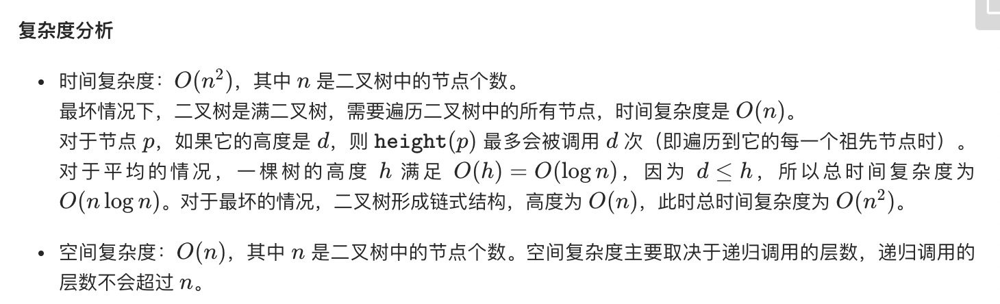
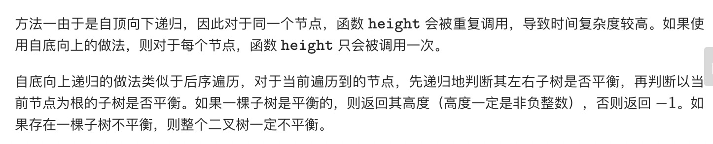
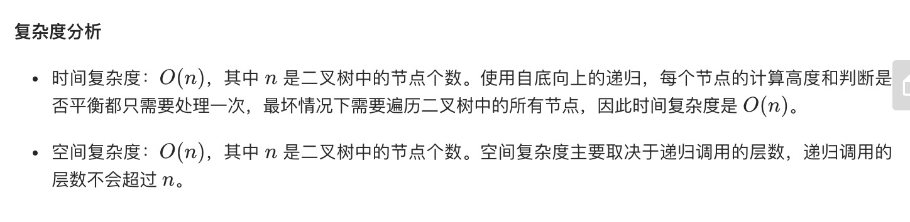

= 平衡二叉树
:toc:
:toc-title:
:toclevels: 5
:sectnums:

== 说明
给定一个二叉树，判断它是否是高度平衡的二叉树。

本题中，一棵高度平衡二叉树定义为：

一个二叉树每个节点 的左右两个子树的高度差的绝对值不超过1。

示例 1:
```
给定二叉树 [3,9,20,null,null,15,7]

    3
   / \
  9  20
    /  \
   15   7
返回 true 。
```
示例 2:
```
给定二叉树 [1,2,2,3,3,null,null,4,4]

       1
      / \
     2   2
    / \
   3   3
  / \
 4   4
返回 false 。
```

== 参考
- https://leetcode-cn.com/problems/balanced-binary-tree/

== 题解
=== 自顶向下递归

```go
func isBalanced(root *TreeNode) bool {
    if root == nil {
        return true
    }
    return abs(dfs(root.Left) - dfs(root.Right)) <= 1 && isBalanced(root.Left) && isBalanced(root.Right)
}

func dfs(root *TreeNode) int {
    result := 1
    if root == nil {
        return 0
    }
    result += max(dfs(root.Left), dfs(root.Right))
    return result
}

func max(x,y int) int {
    if x > y {
        return x
    }
    return y
}

func abs(x int) int {
    if x < 0 {
        return -1 * x
    }
    return x
}
```



=== 自低向下递归




