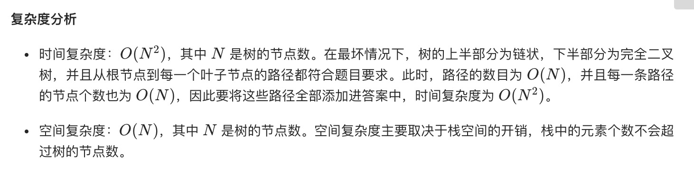
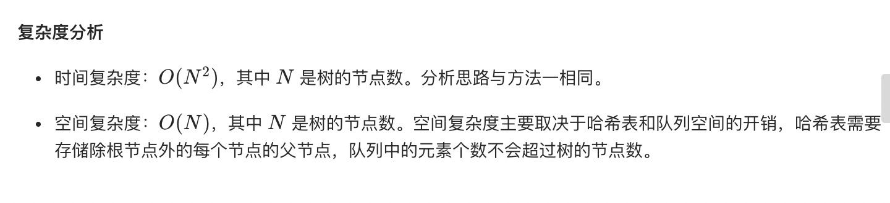

= 路径总和 II
:toclevels:
:toc:
:toc-title:
:sectnums:

== 说明
给定一个二叉树和一个目标和，找到所有从根节点到叶子节点路径总和等于给定目标和的路径。

说明: 叶子节点是指没有子节点的节点。

示例:
给定如下二叉树，以及目标和 sum = 22，
```
              5
             / \
            4   8
           /   / \
          11  13  4
         /  \    / \
        7    2  5   1
```
返回:
```
[
   [5,4,11,2],
   [5,8,4,5]
]

```

== 参考
- https://leetcode-cn.com/problems/path-sum-ii/

== 题解
=== 深度优先搜索
我们可以采用深度优先搜索的方式，枚举每一条从根节点到叶子节点的路径。当我们遍历到叶子节点，且此时路径和恰为目标和时，我们就找到了一条满足条件的路径。

```go
func pathSum(root *TreeNode, sum int) (result [][]int) {
	temp := []int{}
	var dfs func(root *TreeNode, left int)
	dfs = func(root *TreeNode, left int) {
		if root == nil {
			return
		}
		left -= root.Val
		temp = append(temp, root.Val)
		defer func() {
			temp = temp[:len(temp)-1]
		}()
		if root.Left == nil && root.Right == nil && left == 0 {
			result = append(result, append([]int(nil), temp...))
			return
		}
		dfs(root.Left, left)
		dfs(root.Right, left)
	}
	dfs(root, sum)
	return
}
```

```python
def pathSum(root: TreeNode, sum: int) -> [[int]]:
    temp = []
    result = []
    def dfs(root: TreeNode, left: int) :
        if not root :
            return
        left -= root.val
        temp.append(root.val)
        if not root.left and not root.right and left == 0 :
            result.append(temp[:])
        dfs(root.left,left)
        dfs(root.right,left)
        temp.pop()

    dfs(root,sum)
    return result
```



=== 广度优先搜索

```go

type TreeNode struct {
	Val   int
	Left  *TreeNode
	Right *TreeNode
}

type pair struct {
	node *TreeNode
	left int
}

func pathSum(root *TreeNode, sum int) (result [][]int) {
	if root == nil {
		return
	}
	parent := map[*TreeNode]*TreeNode{}
	var getPath func(node *TreeNode) (path []int)
	getPath = func(node *TreeNode) (path []int) {
		for ; node != nil; node = parent[node] {
			path = append(path, node.Val)
		}
		for i, j := 0, len(path)-1; i < j; i++ {
			path[i], path[j] = path[j], path[i]
			j--
		}
		return
	}
	stack := []pair{pair{node: root, left: sum}}
	for len(stack) != 0 {
		p := stack[0]
		stack = stack[1:]
		node := p.node
		left := p.left
		left -= node.Val
		if node.Left == nil && node.Right == nil {
			if left == 0 {
				result = append(result, getPath(node))
			}
		} else {
			if node.Left != nil {
				parent[node.Left] = node
				stack = append(stack, pair{node: node.Left, left: left})
			}
			if node.Right != nil {
				parent[node.Right] = node
				stack = append(stack, pair{node: node.Right, left: left})
			}
		}
	}
	return
}

```

```python
def pathSum(root: TreeNode, sum: int) -> [[int]]:
    result = []
    if not root :
        return result
    def getpath(node) :
        temp = []
        while node :
            temp.append(node.val)
            node = parent.get(node)
        result.append(temp[::-1])

    parent = {}
    stack = [{"node":root, "left":sum}]
    while stack :
        p = stack[0]
        stack = stack[1:]
        node = p["node"]
        left = p["left"]
        left -= node.val
        if not node.left and not node.right :
            if left == 0 :
                getpath(node)
        else :
            if node.left :
                parent[node.left] = node
                stack.append({"node":node.left,"left":left})
            if node.right :
                parent[node.right] = node
                stack.append({"node":node.right,"left":left})
    return result

```

