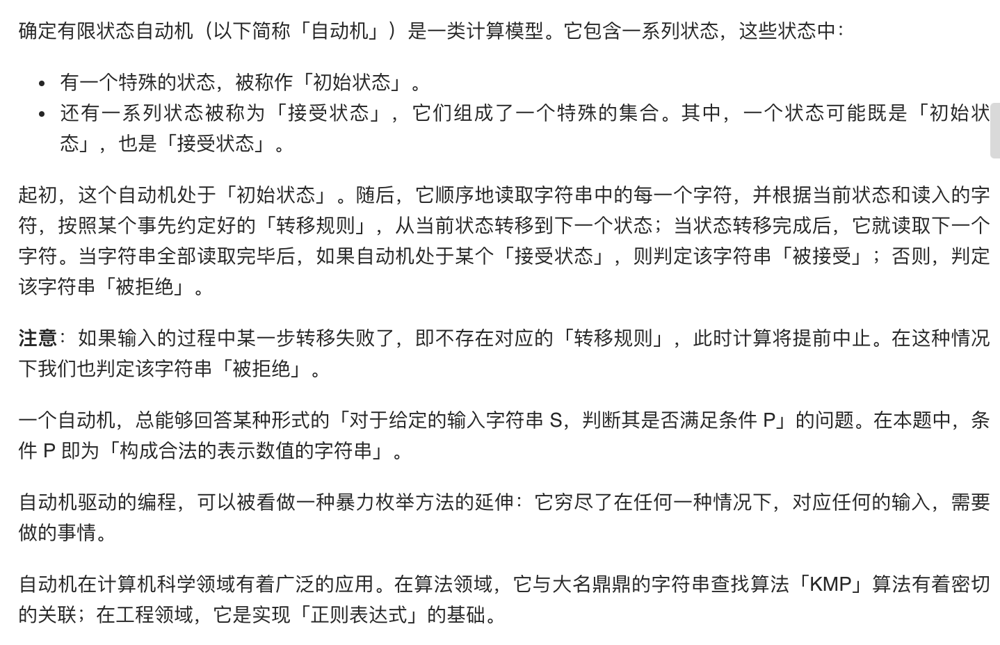
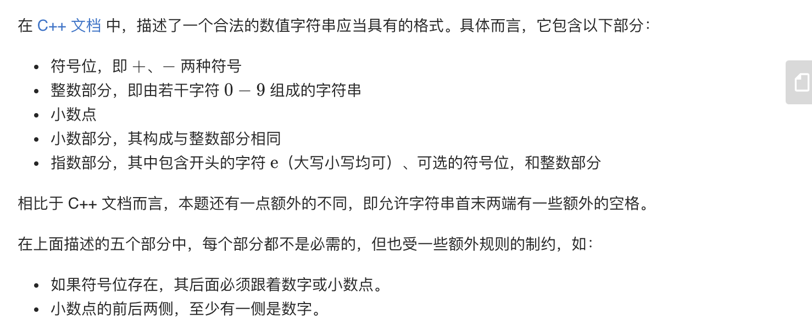
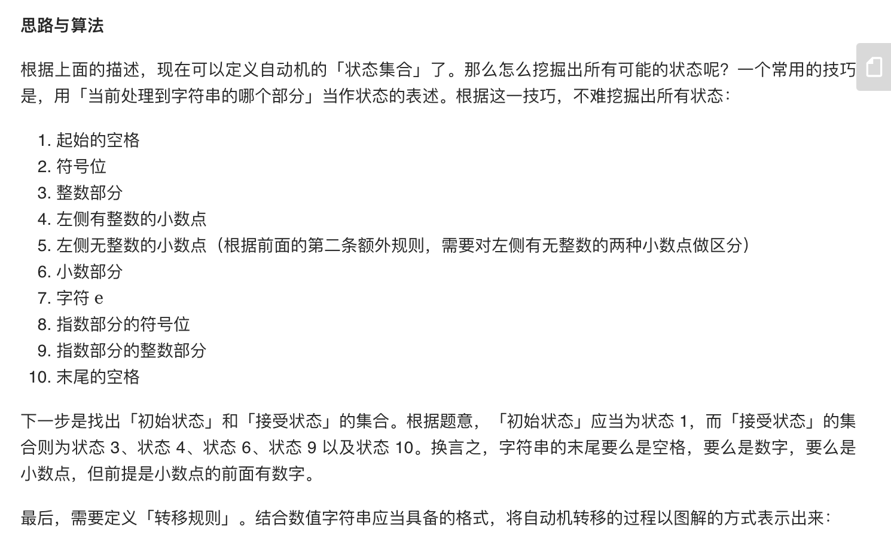
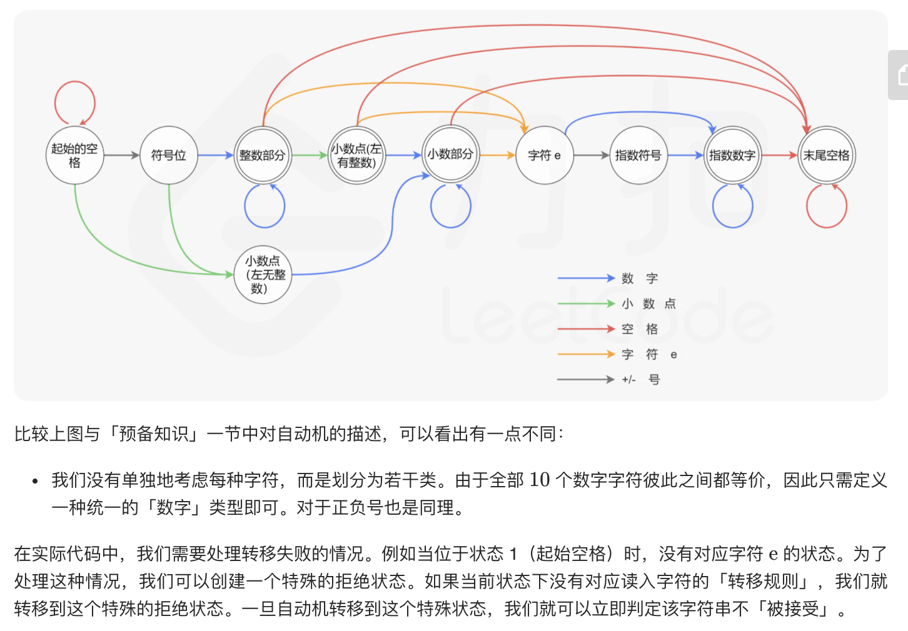

= 表示数值的字符串
:toc:
:toc-title:
:toclevels:
:sectnums:

== 说明
请实现一个函数用来判断字符串是否表示数值（包括整数和小数）。例如，字符串"+100"、"5e2"、"-123"、"3.1416"、"-1E-16"、"0123"都表示数值，但"12e"、"1a3.14"、"1.2.3"、"+-5"及"12e+5.4"都不是。

== 参考
- https://leetcode-cn.com/problems/biao-shi-shu-zhi-de-zi-fu-chuan-lcof/

== 题解
=== 确定有限状态自动机








```go
type State int
type CharType int

const (
    STATE_INITIAL State = iota
    STATE_INT_SIGN
    STATE_INTEGER
    STATE_POINT
    STATE_POINT_WITHOUT_INT
    STATE_FRACTION
    STATE_EXP
    STATE_EXP_SIGN
    STATE_EXP_NUMBER
    STATE_END
)

const (
    CHAR_NUMBER CharType = iota
    CHAR_EXP
    CHAR_POINT
    CHAR_SIGN
    CHAR_SPACE
    CHAR_ILLEGAL
)

func toCharType(ch byte) CharType {
    switch ch {
    case '0', '1', '2', '3', '4', '5', '6', '7', '8', '9':
        return CHAR_NUMBER
    case 'e', 'E':
        return CHAR_EXP
    case '.':
        return CHAR_POINT
    case '+', '-':
        return CHAR_SIGN
    case ' ':
        return CHAR_SPACE
    default:
        return CHAR_ILLEGAL
    }
}

func isNumber(s string) bool {
    transfer := map[State]map[CharType]State{
        STATE_INITIAL: map[CharType]State{
            CHAR_SPACE:  STATE_INITIAL,
            CHAR_NUMBER: STATE_INTEGER,
            CHAR_POINT:  STATE_POINT_WITHOUT_INT,
            CHAR_SIGN:   STATE_INT_SIGN,
        },
        STATE_INT_SIGN: map[CharType]State{
            CHAR_NUMBER: STATE_INTEGER,
            CHAR_POINT:  STATE_POINT_WITHOUT_INT,
        },
        STATE_INTEGER: map[CharType]State{
            CHAR_NUMBER: STATE_INTEGER,
            CHAR_EXP:    STATE_EXP,
            CHAR_POINT:  STATE_POINT,
            CHAR_SPACE:  STATE_END,
        },
        STATE_POINT: map[CharType]State{
            CHAR_NUMBER: STATE_FRACTION,
            CHAR_EXP:    STATE_EXP,
            CHAR_SPACE:  STATE_END,
        },
        STATE_POINT_WITHOUT_INT: map[CharType]State{
            CHAR_NUMBER: STATE_FRACTION,
        },
        STATE_FRACTION: map[CharType]State{
            CHAR_NUMBER: STATE_FRACTION,
            CHAR_EXP:    STATE_EXP,
            CHAR_SPACE:  STATE_END,
        },
        STATE_EXP: map[CharType]State{
            CHAR_NUMBER: STATE_EXP_NUMBER,
            CHAR_SIGN:   STATE_EXP_SIGN,
        },
        STATE_EXP_SIGN: map[CharType]State{
            CHAR_NUMBER: STATE_EXP_NUMBER,
        },
        STATE_EXP_NUMBER: map[CharType]State{
            CHAR_NUMBER: STATE_EXP_NUMBER,
            CHAR_SPACE:  STATE_END,
        },
        STATE_END: map[CharType]State{
            CHAR_SPACE: STATE_END,
        },
    }
    state := STATE_INITIAL
    for i := 0; i < len(s); i++ {
        typ := toCharType(s[i])
        if _, ok := transfer[state][typ]; !ok {
            return false
        } else {
            state = transfer[state][typ]
        }
    }
    return state == STATE_INTEGER || state == STATE_POINT || state == STATE_FRACTION || state == STATE_EXP_NUMBER || state == STATE_END
}

```

复杂度分析

- 时间复杂度：O(N)，其中 N 为字符串的长度。我们需要遍历字符串的每个字符，其中状态转移所需的时间复杂度为 O(1)。
- 空间复杂度：O(1)。只需要创建固定大小的状态转移表。


