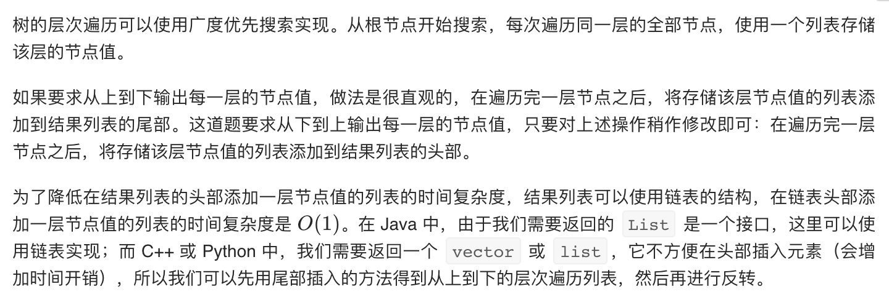

= 二叉树的层次遍历 II
:toc:
:toc-title:
:toclevels:
:sectnums:


== 说明
给定一个二叉树，返回其节点值自底向上的层次遍历。 （即按从叶子节点所在层到根节点所在的层，逐层从左向右遍历）

例如：
给定二叉树 [3,9,20,null,null,15,7],
```
    3
   / \
  9  20
    /  \
   15   7
```
返回其自底向上的层次遍历为：
```
[
  [15,7],
  [9,20],
  [3]
]
```

== 参考
- https://leetcode-cn.com/problems/binary-tree-level-order-traversal-ii/

== 题解
=== 广度优先



```go
func levelOrderBottom(root *TreeNode) [][]int {
    result := [][]int{}
    if root == nil {
        return result
    }
    stack := []*TreeNode{root}
    for len(stack) != 0 {
        level := []int{}
        size := len(stack)
        for i := 0 ; i < size ; i ++ {
            node := stack[0]
            stack = stack[1:]
            level = append(level, node.Val)
            if node.Left != nil {
                stack = append(stack, node.Left)
            }
            if node.Right != nil {
                stack = append(stack, node.Right)
            }
        }
        result = append(result, level)
    }
    i ,j := 0, len(result)-1
    for i <= j {
        result[i] , result[j] = result[j] , result[i]
        i ++
        j --
    }
    return result
}
```

复杂度分析

- 时间复杂度：O(n)，其中 n 是二叉树中的节点个数。每个节点访问一次，结果列表使用链表的结构时，在结果列表头部添加一层节点值的列表的时间复杂度是 O(1)，因此总时间复杂度是 O(n)。
- 空间复杂度：O(n)，其中 n 是二叉树中的节点个数。空间复杂度取决于队列开销，队列中的节点个数不会超过 n。


