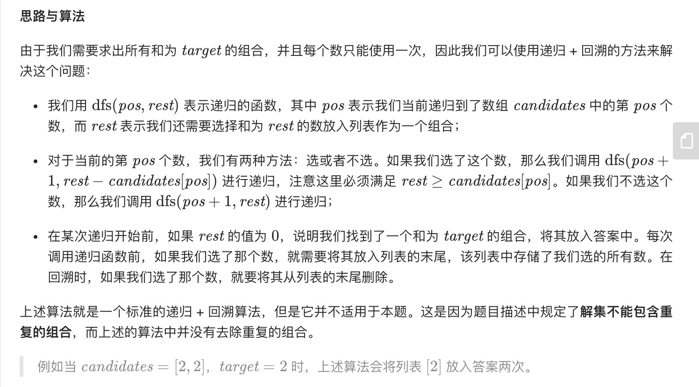
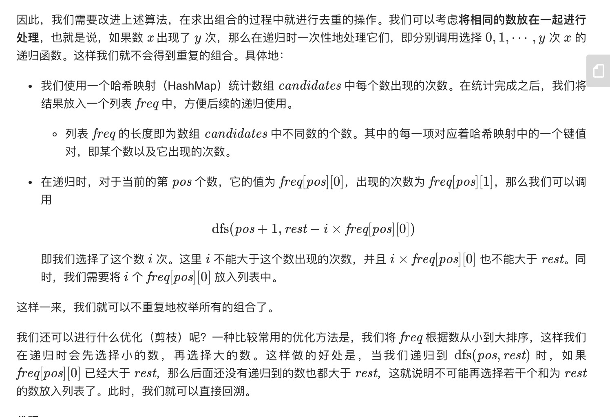
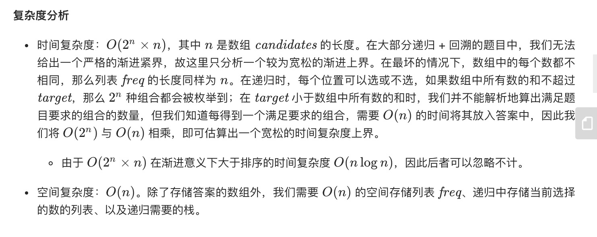

= 组合总和 II
:toc:
:toc-title:
:toclevels:
:sectnums:

== 说明
给定一个数组 candidates 和一个目标数 target ，找出 candidates 中所有可以使数字和为 target 的组合。

candidates 中的每个数字在每个组合中只能使用一次。

说明：

- 所有数字（包括目标数）都是正整数。
- 解集不能包含重复的组合。 

示例 1:
```
输入: candidates = [10,1,2,7,6,1,5], target = 8,
所求解集为:
[
  [1, 7],
  [1, 2, 5],
  [2, 6],
  [1, 1, 6]
]
```
示例 2:
```
输入: candidates = [2,5,2,1,2], target = 5,
所求解集为:
[
  [1,2,2],
  [5]
]
```

== 参考
- https://leetcode-cn.com/problems/combination-sum-ii/

== 题解
=== 回溯




```go
func combinationSum2(candidates []int, target int) (result [][]int) {
    sort.Ints(candidates)
    var freq [][2]int
    for _, num := range candidates {
        if freq == nil || num != freq[len(freq)-1][0] {
            freq = append(freq,[2]int{num,1})
        } else {
            freq[len(freq)-1][1]++
        }
    }

    temp := []int{}
    var dfs func(target ,idx int)
    dfs = func(target, idx int) {
        if target == 0 {
            comb := make([]int, len(temp))
            copy(comb, temp)
            result = append(result, comb)
            return
        }
        if idx == len(freq) || target < freq[idx][0] {
            return
        }
        dfs(target,idx+1)
        most := min(target / freq[idx][0] , freq[idx][1])
        for i := 1 ; i <= most ; i ++ {
            temp = append(temp,freq[idx][0])
            dfs(target - i * freq[idx][0], idx+1)
        }
        temp = temp[:len(temp)-most]
    }
    dfs(target,0)
    return
}

func min(x,y int) int{
    if x < y {
        return x
    }
    return y
}
```



