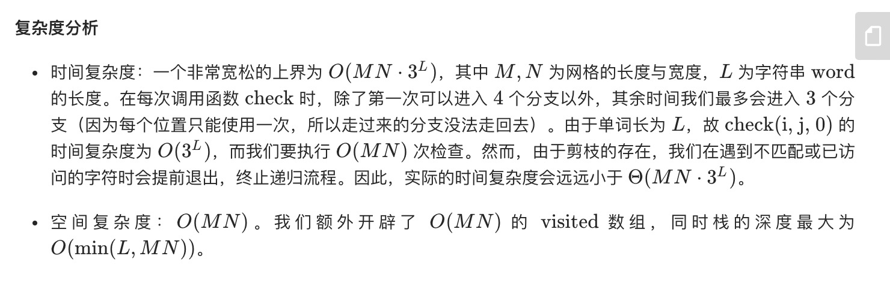

= 单词搜索
:toc:
:toc-title:
:toclevels:
:sectnums:

== 说明

给定一个二维网格和一个单词，找出该单词是否存在于网格中。

单词必须按照字母顺序，通过相邻的单元格内的字母构成，其中“相邻”单元格是那些水平相邻或垂直相邻的单元格。同一个单元格内的字母不允许被重复使用。

示例:
```
board =
[
  ['A','B','C','E'],
  ['S','F','C','S'],
  ['A','D','E','E']
]

给定 word = "ABCCED", 返回 true
给定 word = "SEE", 返回 true
给定 word = "ABCB", 返回 false
 
```
提示：

- board 和 word 中只包含大写和小写英文字母。
- 1 <= board.length <= 200
- 1 <= board[i].length <= 200
- 1 <= word.length <= 10^3

== 参考
- https://leetcode-cn.com/problems/word-search/

== 题解

=== 深度优先搜索


```go
type pair struct{ x, y int }

var directions = []pair{{-1, 0}, {1, 0}, {0, -1}, {0, 1}} // 上下左右

func exist(board [][]byte, word string) bool {
	h, w := len(board), len(board[0])
	vis := make([][]bool, h)
	for i := range vis {
		vis[i] = make([]bool, w)
	}
	var check func(i, j, k int) bool
	check = func(i, j, k int) bool {
		if board[i][j] != word[k] { // 剪枝：当前字符不匹配
			return false
		}
		if k == len(word)-1 { // 单词存在于网格中
			return true
		}
		vis[i][j] = true
		defer func() { vis[i][j] = false }() // 回溯时还原已访问的单元格
		for _, dir := range directions {
			if newI, newJ := i+dir.x, j+dir.y; 0 <= newI && newI < h && 0 <= newJ && newJ < w && !vis[newI][newJ] {
				if check(newI, newJ, k+1) {
					return true
				}
			}
		}
		return false
	}
	for i, row := range board {
		for j := range row {
			if check(i, j, 0) {
				return true
			}
		}
	}
	return false
}


```


