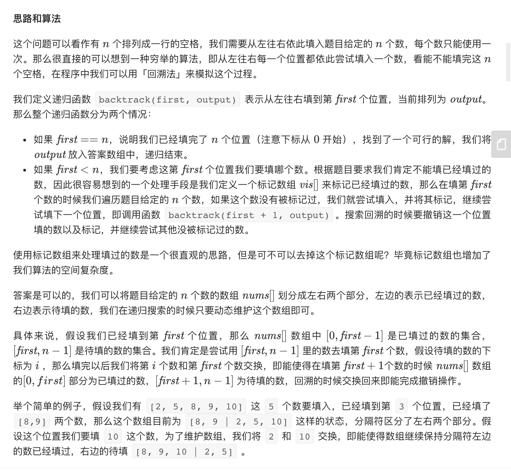
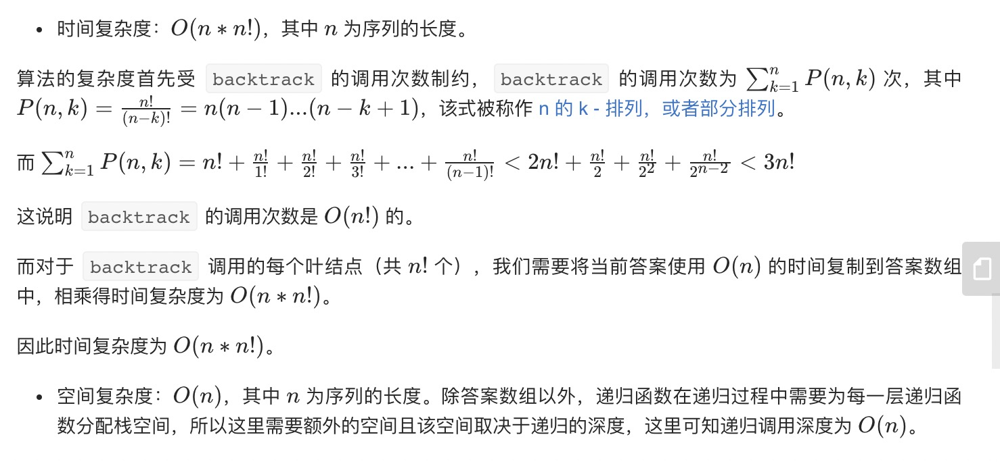

= 全排列
:toc-title:
:toc:
:toclevels: 5
:sectnums:

== 说明
给定一个 没有重复 数字的序列，返回其所有可能的全排列。

示例:
```
输入: [1,2,3]
输出:
[
  [1,2,3],
  [1,3,2],
  [2,1,3],
  [2,3,1],
  [3,1,2],
  [3,2,1]
]
```

== 参考
- https://leetcode-cn.com/problems/permutations/

== 题解
=== 回溯


```go
func permute(nums []int) (result [][]int) {
    var dfs func(cur int)
    n := len(nums)
    dfs = func(cur int) {
        if cur == n {
            p := make([]int,n)
            copy(p, nums)
            result = append(result, p)
            return
        }
        for i := cur ; i < n ; i ++ {
            nums[i], nums[cur] = nums[cur],nums[i]
            dfs(cur+1)
            nums[i], nums[cur] = nums[cur],nums[i]
        }

    }
    dfs(0)
    return
}
```

```python
def permute(nums: [int]) -> [[int]]:
    result = []
    n = len(nums)
    def dfs(cur) :
        if cur == n :
            result.append(nums[:])
            return
        for i in range(cur,n) :
            nums[i],nums[cur] = nums[cur],nums[i]
            dfs(cur+1)
            nums[i],nums[cur] = nums[cur],nums[i]
    dfs(0)
    return result
```


