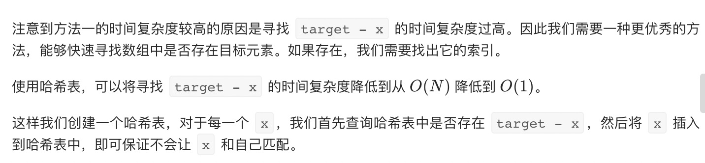
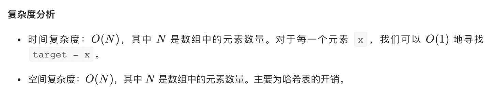

= 两数之和
:toc:
:toclevels: 5
:toc-title:
:sectnums:


== 说明
给定一个整数数组 nums 和一个目标值 target，请你在该数组中找出和为目标值的那 两个 整数，并返回他们的数组下标。

你可以假设每种输入只会对应一个答案。但是，数组中同一个元素不能使用两遍。

示例:
```
给定 nums = [2, 7, 11, 15], target = 9

因为 nums[0] + nums[1] = 2 + 7 = 9
所以返回 [0, 1]

```


== 参考
- https://leetcode-cn.com/problems/two-sum/

== 题解


```go
func twoSum(nums []int, target int) []int {
    tmp := map[int]int{}
    for i , v := range nums {
        cha := target - v
        if k , ok := tmp[cha] ; ok {
            return []int{k,i}
        }
        tmp[v] = i
    }
    return nil
}
```



