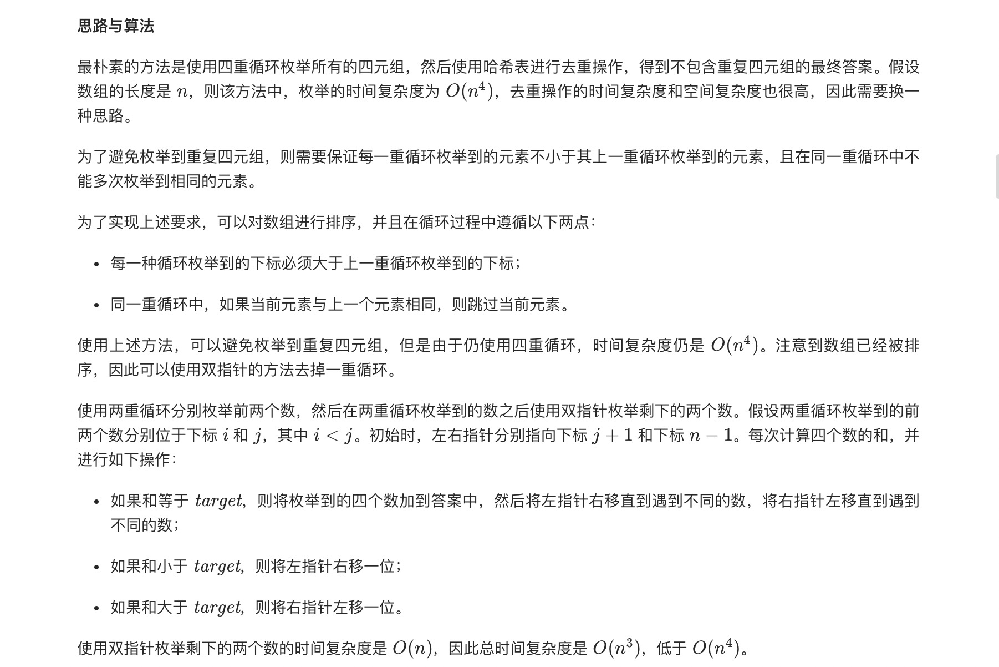
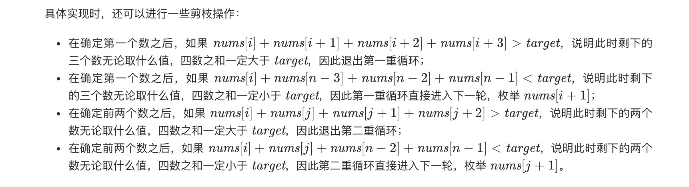
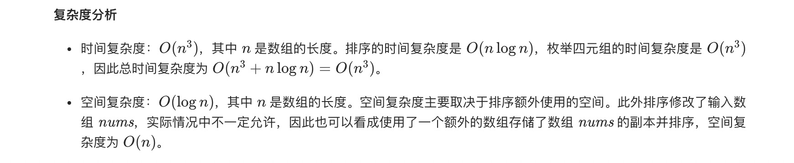

= 四数之和
:toc:
:toclevels:
:toc-title:
:sectnums:

== 说明
给定一个包含 n 个整数的数组 nums 和一个目标值 target，判断 nums 中是否存在四个元素 a，b，c 和 d ，使得 a + b + c + d 的值与 target 相等？找出所有满足条件且不重复的四元组。

注意：

答案中不可以包含重复的四元组。

示例：
```
给定数组 nums = [1, 0, -1, 0, -2, 2]，和 target = 0。

满足要求的四元组集合为：
[
  [-1,  0, 0, 1],
  [-2, -1, 1, 2],
  [-2,  0, 0, 2]
]
```

== 参考
- https://leetcode-cn.com/problems/4sum/

== 题解
=== 排序 + 双指针




```go
func fourSum(nums []int, target int) (quadruplets [][]int) {
	sort.Ints(nums)
	n := len(nums)
	for i := 0; i < n-3 && nums[i]+nums[i+1]+nums[i+2]+nums[i+3] <= target; i++ {
		if i > 0 && nums[i] == nums[i-1] || nums[i]+nums[n-3]+nums[n-2]+nums[n-1] < target {
			continue
		}
		for j := i + 1; j < n-2 && nums[i]+nums[j]+nums[j+1]+nums[j+2] <= target; j++ {
			if j > i+1 && nums[j] == nums[j-1] || nums[i]+nums[j]+nums[n-2]+nums[n-1] < target {
				continue
			}
			for left, right := j+1, n-1; left < right; {
				if sum := nums[i] + nums[j] + nums[left] + nums[right]; sum == target {
					quadruplets = append(quadruplets, []int{nums[i], nums[j], nums[left], nums[right]})
					for left++; left < right && nums[left] == nums[left-1]; left++ {
					}
					for right--; left < right && nums[right] == nums[right+1]; right-- {
					}
				} else if sum < target {
					left++
				} else {
					right--
				}
			}
		}
	}
	return
}

```


