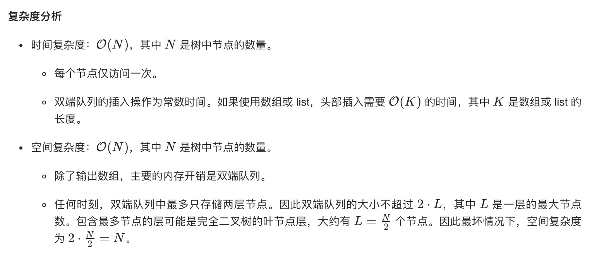

= 二叉树的锯齿形层次遍历
:toc:
:toclevels:
:toc-title:
:sectnums:

== 说明
给定一个二叉树，返回其节点值的锯齿形层次遍历。（即先从左往右，再从右往左进行下一层遍历，以此类推，层与层之间交替进行）。

例如：
给定二叉树 [3,9,20,null,null,15,7],
```
    3
   / \
  9  20
    /  \
   15   7
返回锯齿形层次遍历如下：

[
  [3],
  [20,9],
  [15,7]
]

```

== 参考
- https://leetcode-cn.com/problems/binary-tree-zigzag-level-order-traversal/solution/er-cha-shu-de-ju-chi-xing-ceng-ci-bian-li-by-leetc/

== 题解
=== 广度优先

```go
func zigzagLevelOrder(root *TreeNode) (result [][]int) {
    if root == nil {
        return
    }
    count := 0
    queue := []*TreeNode{root}
    for len(queue) > 0 {
        size := len(queue)
        tmp := []int{}
        for i := 0 ; i < size ; i ++ {
            node := queue[0]
            queue = queue[1:]
            tmp = append(tmp,node.Val)
            if node.Left != nil {
                queue = append(queue, node.Left)
            }
            if node.Right != nil {
                queue = append(queue, node.Right)
            }
        }
        if count % 2 == 1 {
            reverse(tmp)
        }
        result = append(result, append([]int{},tmp...))
        count ++
    }
    return
}

func reverse(l []int) {
    for i, j := 0, len(l)-1 ; i < j ;i ++ {
        l[i],l[j] = l[j],l[i]
        j --
    }
}
```



