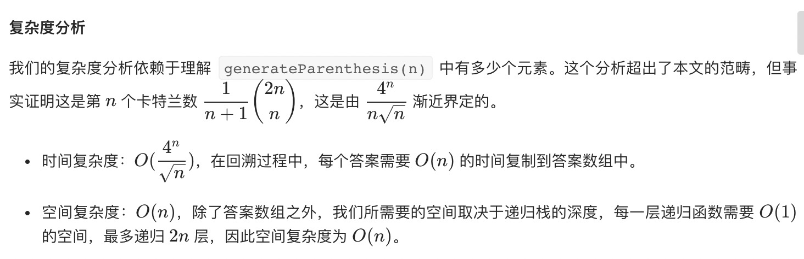

= 括号生成
:toc:
:toclevels: 5
:toc-title:
:sectnums:

== 说明
数字 n 代表生成括号的对数，请你设计一个函数，用于能够生成所有可能的并且 有效的 括号组合。

示例：
```
输入：n = 3
输出：[
       "((()))",
       "(()())",
       "(())()",
       "()(())",
       "()()()"
     ]

```
== 参考
- https://leetcode-cn.com/problems/generate-parentheses/

== 题解
=== 回溯

```python
def generateParenthesis(n: int) -> [str]:
    result = []
    def dfs(S, left, right) :
        if len(S) == 2 * n :
            result.append("".join(S))
            return
        if left < n :
            S.append("(")
            dfs(S, left+1 , right)
            S.pop()
        if right < left :
            S.append(")")
            dfs(S,left,right+1)
            S.pop()
    dfs([],0,0)
    return result
```

```go
func generateParenthesis(n int) (result []string) {
	var dfs func(S []string, left, right int)
	dfs = func(S []string, left, right int) {
		if len(S) == 2*n {
			result = append(result, strings.Join(S, ""))
			return
		}
		if left < n {
			S = append(S, "(")
			dfs(S, left+1, right)
			S = S[:len(S)-1]
		}
		if right < left {
			S = append(S, ")")
			dfs(S, left, right+1)
			S = S[:len(S)-1]
		}
	}
	dfs([]string{}, 0, 0)
	return
}

```



