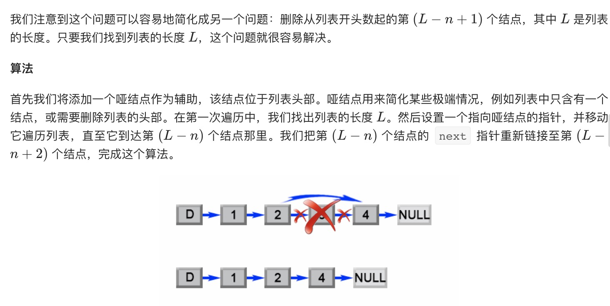
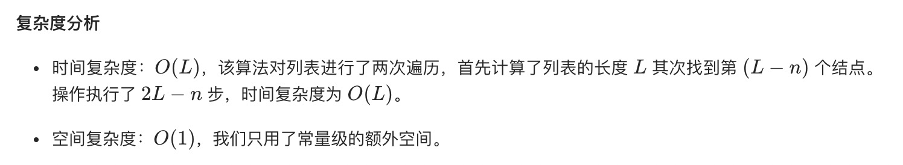
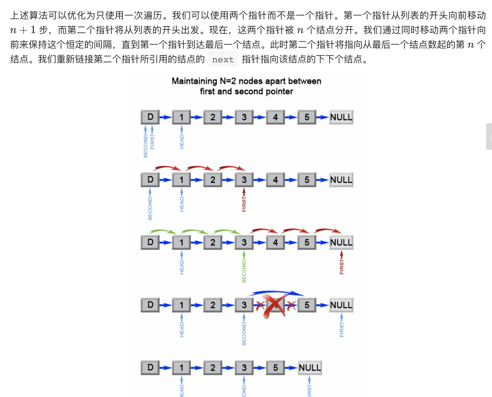

= 删除链表的倒数第N个节点
:toc:
:toclevels: 5
:toc-title:
:sectnums:


== 说明
给定一个链表，删除链表的倒数第 n 个节点，并且返回链表的头结点。

示例：
```
给定一个链表: 1->2->3->4->5, 和 n = 2.

当删除了倒数第二个节点后，链表变为 1->2->3->5.
```
说明：

给定的 n 保证是有效的。

进阶：

你能尝试使用一趟扫描实现吗？

== 参考
- https://leetcode-cn.com/problems/remove-nth-node-from-end-of-list/

== 题解
=== 两次遍历算法


```go
func removeNthFromEnd(head *ListNode, n int) *ListNode {
    length := 0
    dummy := &ListNode{Val: 0}
    dummy.Next = head
    first := head
    for first != nil {
        length ++
        first = first.Next
    }
    length -= n
    first = dummy
    for length > 0 {
        first = first.Next
        length --
    }
    first.Next = first.Next.Next
    return dummy.Next
}
```



=== 一次遍历算法


```go
func removeNthFromEnd(head *ListNode, n int) *ListNode {
	dummy := &ListNode{Val: 0}
	dummy.Next = head

	first := dummy
	seconed := dummy

	for i := 0; i <= n; i++ {
		first = first.Next
	}
	for first != nil {
		first = first.Next
		seconed = seconed.Next
	}
	seconed.Next = seconed.Next.Next
	return dummy.Next
}
```

