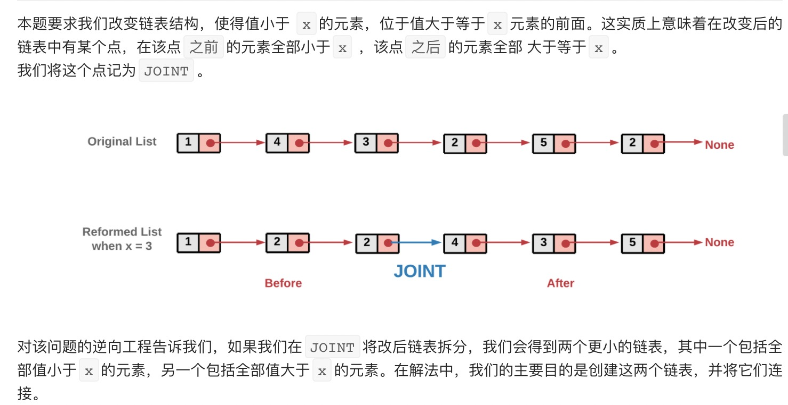
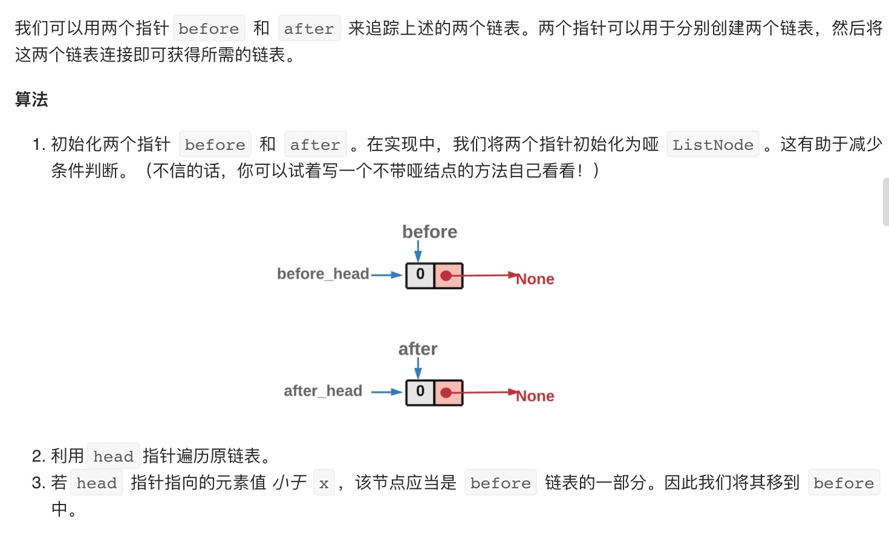
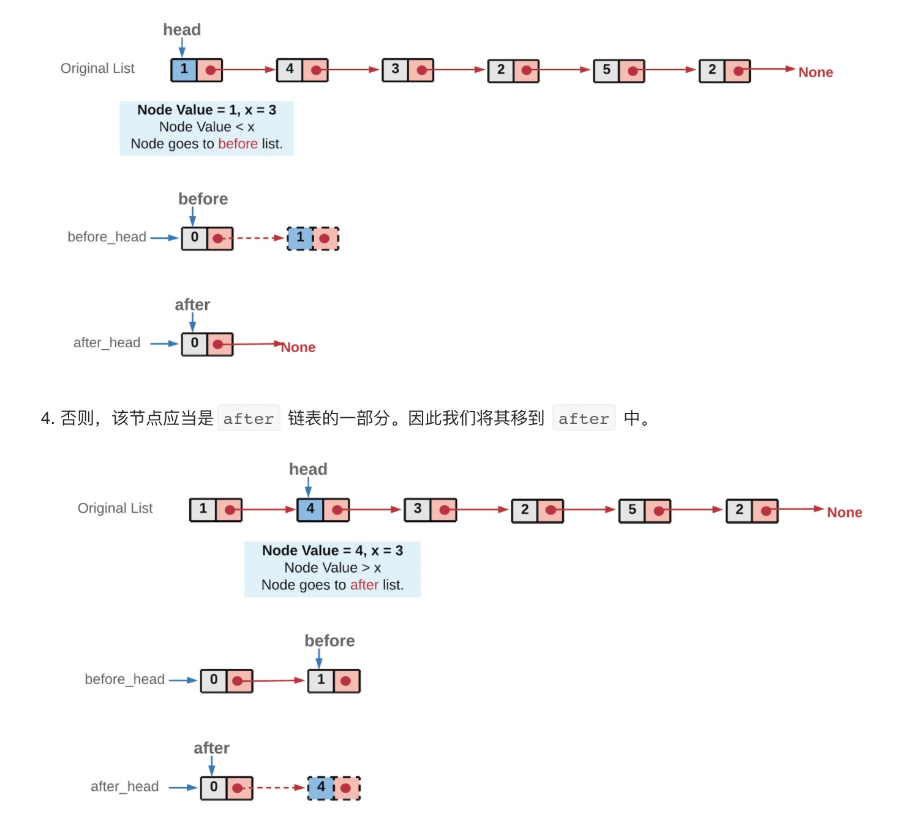
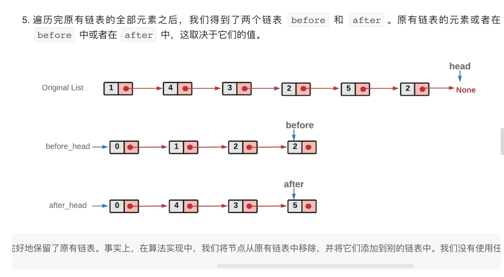
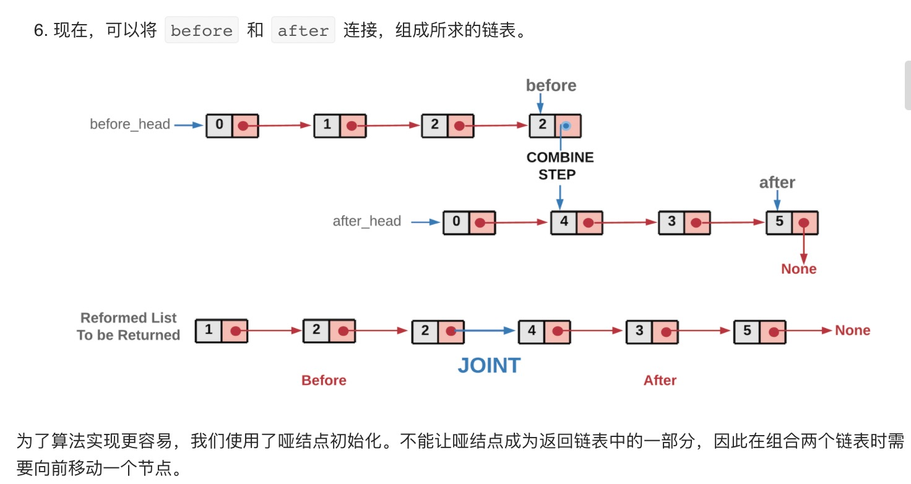

= 分隔链表
:toc:
:toc-title:
:toclevels: 5
:sectnums:

== 说明
给定一个链表和一个特定值 x，对链表进行分隔，使得所有小于 x 的节点都在大于或等于 x 的节点之前。

你应当保留两个分区中每个节点的初始相对位置。

 

示例:
```
输入: head = 1->4->3->2->5->2, x = 3
输出: 1->2->2->4->3->5
```

== 参考
- https://leetcode-cn.com/problems/partition-list/submissions/

== 题解
=== 双指针






```go
func partition(head *ListNode, x int) *ListNode {
	_first := &ListNode{Val: 0}
	_second := &ListNode{Val: 0}
	first_head, first := _first, _first
	second_head, second := _second, _second

	for head != nil {
		if head.Val < x {
			first.Next = head
			first = first.Next
		} else {
			second.Next = head
			second = second.Next
		}
		head = head.Next
	}
	second.Next = nil
	first.Next = second_head.Next
	return first_head.Next
}
```


