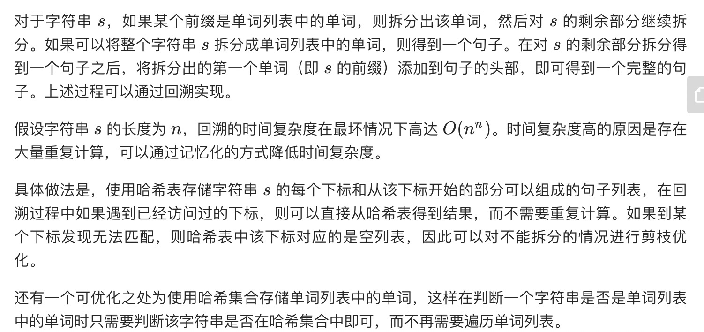

= 单词拆分 II
:toc:
:toc-title:
:toclevels:
:sectnums:

== 说明
给定一个非空字符串 s 和一个包含非空单词列表的字典 wordDict，在字符串中增加空格来构建一个句子，使得句子中所有的单词都在词典中。返回所有这些可能的句子。

说明：

分隔时可以重复使用字典中的单词。
你可以假设字典中没有重复的单词。
示例 1：
```
输入:
s = "catsanddog"
wordDict = ["cat", "cats", "and", "sand", "dog"]
输出:
[
  "cats and dog",
  "cat sand dog"
]
```
示例 2：
```
输入:
s = "pineapplepenapple"
wordDict = ["apple", "pen", "applepen", "pine", "pineapple"]
输出:
[
  "pine apple pen apple",
  "pineapple pen apple",
  "pine applepen apple"
]
解释: 注意你可以重复使用字典中的单词。
```
示例 3：
```
输入:
s = "catsandog"
wordDict = ["cats", "dog", "sand", "and", "cat"]
输出:
[]

```

== 参考
- https://leetcode-cn.com/problems/word-break-ii/

== 题解


```go
func wordBreak(s string, wordDict []string) (sentences []string) {
	wordmap := map[string]bool{}
    for _,word := range wordDict {
        wordmap[word] = true
    }
    n := len(s)
    dp := make([][][]string,n)

    var backtrace func(index int) [][]string
    backtrace = func(index int) [][]string{
        if dp[index] != nil {
            return dp[index]
        }
        wordList := [][]string{}
        for i := index + 1 ; i < n ; i ++ {
            word := s[index:i]
            if _,ok := wordmap[word] ; ok {
                for _, nexttrace := range backtrace(i) {
                    wordList = append(wordList, append([]string{word}, nexttrace...))
                }
            }
        }
        word := s[index:]
        if _,ok := wordmap[word] ; ok {
            wordList = append(wordList, []string{word})
        }
        dp[index] = wordList
        return wordList
    }

    for _, item := range backtrace(0) {
        sentences = append(sentences, strings.Join(item," "))
    }
    return
}

```

```python
from functools import lru_cache

def wordBreak(s: str, wordDict: [str]) -> [str]:
    wordmap = {}
    for item in wordDict :
        wordmap[item] = True
    n = len(s)
    dp = [[]] * n
    result = []

    # 通过缓存避免超时
    @lru_cache(None)
    def backtrace(index) :
        if dp[index] :
            return dp[index]
        wordList = []
        for i in range(index+1,n) :
            word = s[index:i]
            if wordmap.get(word) :
                for nexttrace in backtrace(i) :
                    tmp = [word]
                    tmp.extend(nexttrace)
                    wordList.append(tmp)
        word = s[index:]
        if wordmap.get(word) :
            wordList.append([word])
        dp[index] = wordList
        return wordList
    for item in backtrace(0) :
        result.append(" ".join(item))
    return result

```

- python 的解法中使用了 functools.lru_cache ，设置了缓存，可以有效避免重复计算。

