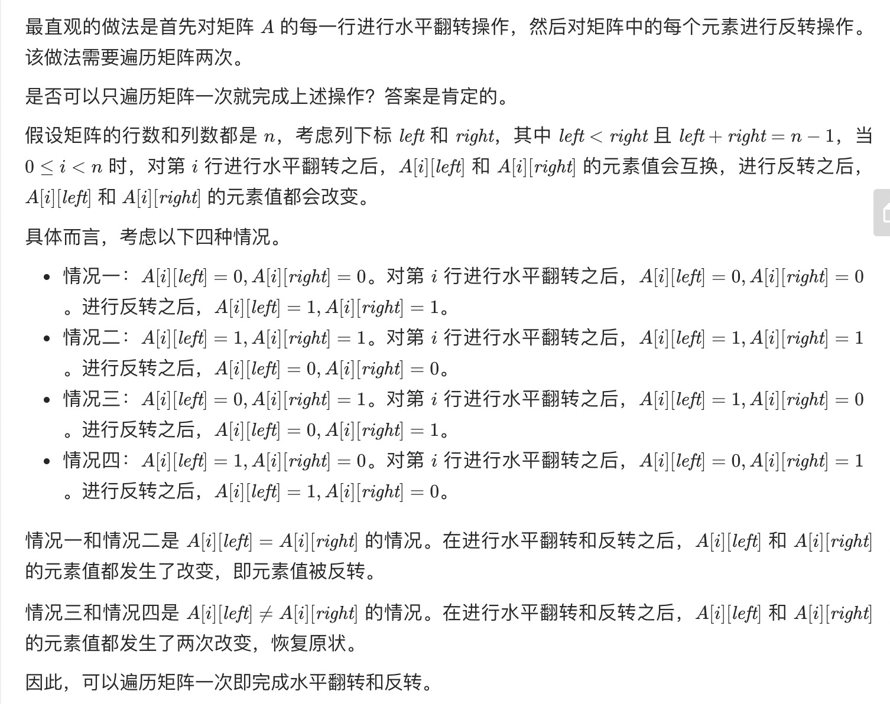
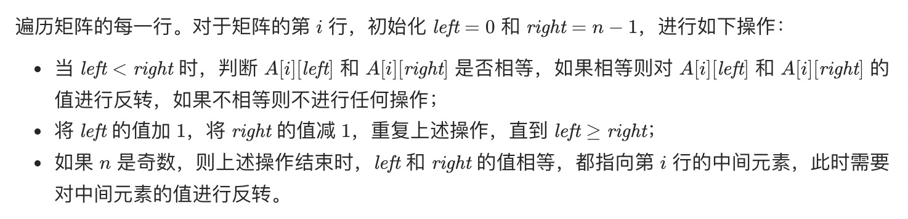

= 翻转图像
:toc:
:toclevels: 5
:sectnums:
:toc-title:

== 说明
给定一个二进制矩阵 A，我们想先水平翻转图像，然后反转图像并返回结果。

水平翻转图片就是将图片的每一行都进行翻转，即逆序。例如，水平翻转 [1, 1, 0] 的结果是 [0, 1, 1]。

反转图片的意思是图片中的 0 全部被 1 替换， 1 全部被 0 替换。例如，反转 [0, 1, 1] 的结果是 [1, 0, 0]。

 

示例 1：
```
输入：[[1,1,0],[1,0,1],[0,0,0]]
输出：[[1,0,0],[0,1,0],[1,1,1]]
解释：首先翻转每一行: [[0,1,1],[1,0,1],[0,0,0]]；
     然后反转图片: [[1,0,0],[0,1,0],[1,1,1]]
```
示例 2：
```
输入：[[1,1,0,0],[1,0,0,1],[0,1,1,1],[1,0,1,0]]
输出：[[1,1,0,0],[0,1,1,0],[0,0,0,1],[1,0,1,0]]
解释：首先翻转每一行: [[0,0,1,1],[1,0,0,1],[1,1,1,0],[0,1,0,1]]；
     然后反转图片: [[1,1,0,0],[0,1,1,0],[0,0,0,1],[1,0,1,0]]
 
```
提示：

- 1 <= A.length = A[0].length <= 20
- 0 <= A[i][j] <= 1


== 参考
- https://leetcode-cn.com/problems/flipping-an-image/

== 题解
=== 模拟优化 + 双指针




```go
func flipAndInvertImage(A [][]int) [][]int {
    for _, row := range A {
        left, right := 0, len(row)-1
        for left < right {
            if row[left] == row[right] {
                row[left] ^= 1
                row[right] ^= 1
            }
            left++
            right--
        }
        if left == right {
            row[left] ^= 1
        }
    }
    return A
}
```


```go
func flipAndInvertImage(A [][]int) [][]int {
	if len(A) == 0 {
		return A
	}
	m := len(A)
	n := len(A[0])
	for i := 0; i < m; i++ {
		for j := 0; j < n>>1; j++ {
			A[i][j], A[i][n-j-1] = A[i][n-j-1], A[i][j]
		}
		for j := 0; j < n; j++ {
			A[i][j] ^= 1
		}
	}
	return A
}

```