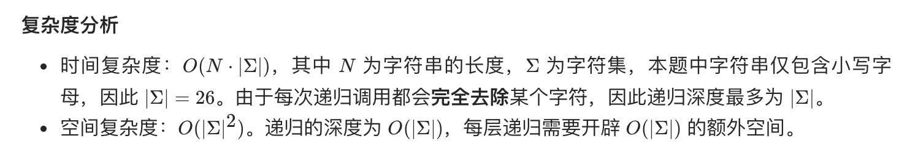

= 至少有 K 个重复字符的最长子串
:toc:
:toclevels: 5
:sectnums:
:toc-title:

== 说明
给你一个字符串 s 和一个整数 k ，请你找出 s 中的最长子串， 要求该子串中的每一字符出现次数都不少于 k 。返回这一子串的长度。

== 参考
- https://leetcode-cn.com/problems/longest-substring-with-at-least-k-repeating-characters/

示例 1：
```
输入：s = "aaabb", k = 3
输出：3
解释：最长子串为 "aaa" ，其中 'a' 重复了 3 次。
```
示例 2：
```
输入：s = "ababbc", k = 2
输出：5
解释：最长子串为 "ababb" ，其中 'a' 重复了 2 次， 'b' 重复了 3 次。
 
```
提示：

- 1 <= s.length <= 104
- s 仅由小写英文字母组成
- 1 <= k <= 105


== 题解
=== 递归
对于字符串 s，如果存在某个字符 ch，它的出现次数大于 0 且小于 k，则任何包含 ch 的子串都不可能满足要求。也就是说，我们将字符串按照 ch 切分成若干段，则满足要求的最长子串一定出现在某个被切分的段内，而不能跨越一个或多个段。


```go

func longestSubstring(s string, k int) (res int) {
	if s == "" {
		return
	}
	cnt := [26]int{}
	for _, ch := range s {
		cnt[ch-'a'] ++
	}

	var split byte
	for i, c := range cnt {
		if 0 < c && c < k {
			split = byte(i) + 'a'
			break
		}
	}
	if split == 0 {
		return len(s)
	}
	for _, subStr := range strings.Split(s, string(split)) {
		res = max(res, longestSubstring(subStr, k))
	}
	return
}

func max(x, y int) int {
	if x > y {
		return x
	}
	return y
}
```




