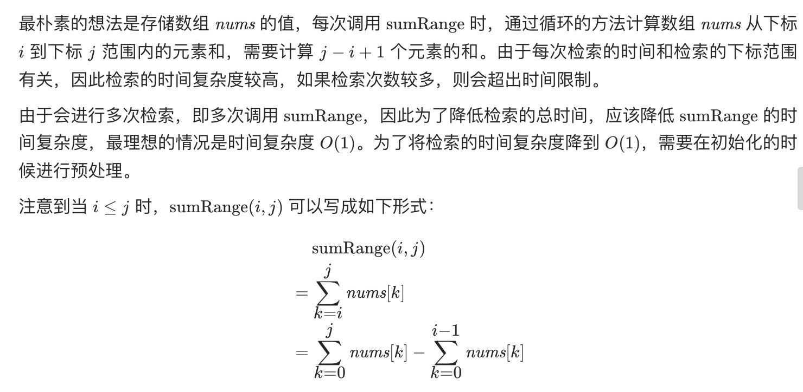
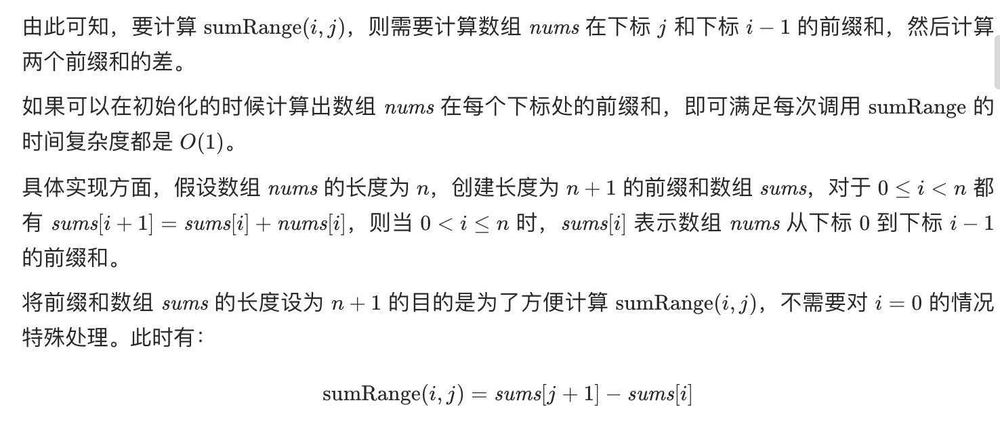

= 区域和检索 - 数组不可变
:toc:
:toclevels: 5
:sectnums:
:toc-title:

== 说明
给定一个整数数组  nums，求出数组从索引 i 到 j（i ≤ j）范围内元素的总和，包含 i、j 两点。

实现 NumArray 类：

NumArray(int[] nums) 使用数组 nums 初始化对象
int sumRange(int i, int j) 返回数组 nums 从索引 i 到 j（i ≤ j）范围内元素的总和，包含 i、j 两点（也就是 sum(nums[i], nums[i + 1], ... , nums[j])）
 

示例：
```
输入：
["NumArray", "sumRange", "sumRange", "sumRange"]
[[[-2, 0, 3, -5, 2, -1]], [0, 2], [2, 5], [0, 5]]
输出：
[null, 1, -1, -3]

解释：
NumArray numArray = new NumArray([-2, 0, 3, -5, 2, -1]);
numArray.sumRange(0, 2); // return 1 ((-2) + 0 + 3)
numArray.sumRange(2, 5); // return -1 (3 + (-5) + 2 + (-1))
numArray.sumRange(0, 5); // return -3 ((-2) + 0 + 3 + (-5) + 2 + (-1))
 
```
提示：

- 0 <= nums.length <= 104
- -105 <= nums[i] <= 105
- 0 <= i <= j < nums.length
- 最多调用 104 次 sumRange 方法


== 参考
- https://leetcode-cn.com/problems/range-sum-query-immutable/

== 题解
=== 前缀和



```go
type NumArray struct {
    sums []int
}


func Constructor(nums []int) NumArray {
    sums := make([]int, len(nums) + 1)
    for i := 0 ; i < len(nums) ; i ++ {
        sums[i + 1] = sums[i] + nums[i]
    }
    return NumArray{sums}
}


func (this *NumArray) SumRange(i int, j int) int {
    return this.sums[j + 1] - this.sums[i]
}


/**
 * Your NumArray object will be instantiated and called as such:
 * obj := Constructor(nums);
 * param_1 := obj.SumRange(i,j);
 */
```


