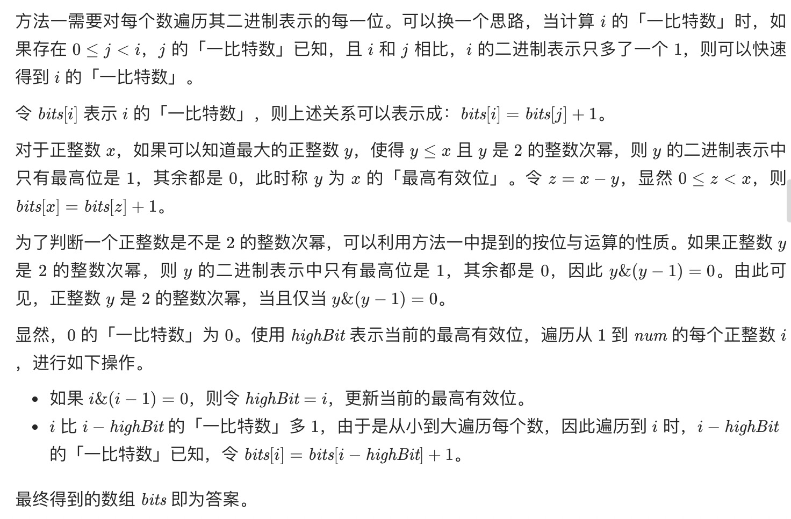
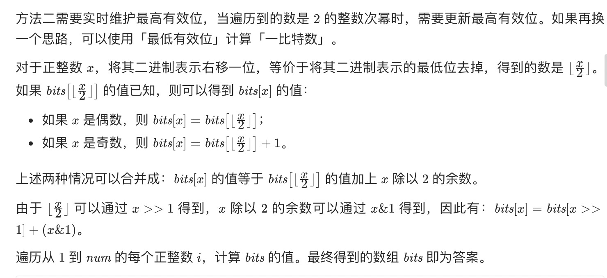

= 比特位计数
:toc:
:toclevels: 5
:sectnums:
:toc-title:


== 说明
给定一个非负整数 num。对于 0 ≤ i ≤ num 范围中的每个数字 i ，计算其二进制数中的 1 的数目并将它们作为数组返回。

示例 1:
```
输入: 2
输出: [0,1,1]
```
示例 2:
```
输入: 5
输出: [0,1,1,2,1,2]
```
进阶:

- 给出时间复杂度为O(n*sizeof(integer))的解答非常容易。但你可以在线性时间O(n)内用一趟扫描做到吗？
- 要求算法的空间复杂度为O(n)。
- 你能进一步完善解法吗？要求在C++或任何其他语言中不使用任何内置函数（如 C++ 中的 __builtin_popcount）来执行此操作。

== 参考
- https://leetcode-cn.com/problems/counting-bits/

== 题解
=== 直接计算
```go
func countBits(num int) (res []int) {
    for i := 0 ; i < num ; i ++ {

    }
}

func countOne(num int) int {
    count := 0
    for ; x >0 ; x &= x- 1 {
        count ++
    }
    return count
}
```


=== 动态规划——最高有效位

```go
func countBits(num int) []int {
    res := make([]int, num + 1)
    highBit := 0
    for i := 1 ; i <= num ; i ++ {
        if i & (i-1) == 0 {
            highBit = i
        }
        res[i] = res[i - highBit] + 1
    }
    return res
}

```

=== 动态规划——最低有效位

```go
func countBits(num int) []int {
    res := make([]int, num + 1)
    for i := 1 ; i <= num ; i ++ {
        res[i] = res[i >> 1] + i & 1
    }
    return res
}

```

=== 动态规划——最低设置位
```go
func countBits(num int) []int {
    res := make([]int, num + 1)
    for i := 1 ; i <= num ; i ++ {
        res[i] = res[i & (i-1)] + 1
    }
    return res
}

```
