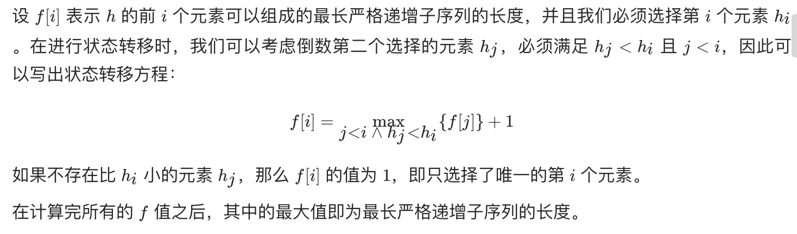

= 俄罗斯套娃信封问题
:toc:
:toclevels: 5
:sectnums:
:toc-title:

== 说明
给你一个二维整数数组 envelopes ，其中 envelopes[i] = [wi, hi] ，表示第 i 个信封的宽度和高度。

当另一个信封的宽度和高度都比这个信封大的时候，这个信封就可以放进另一个信封里，如同俄罗斯套娃一样。

请计算 最多能有多少个 信封能组成一组“俄罗斯套娃”信封（即可以把一个信封放到另一个信封里面）。

注意：不允许旋转信封。

 
示例 1：
```
输入：envelopes = [[5,4],[6,4],[6,7],[2,3]]
输出：3
解释：最多信封的个数为 3, 组合为: [2,3] => [5,4] => [6,7]。
```
示例 2：
```
输入：envelopes = [[1,1],[1,1],[1,1]]
输出：1
 
```
提示：

- 1 <= envelopes.length <= 5000
- envelopes[i].length == 2
- 1 <= wi, hi <= 104


== 参考
- https://leetcode-cn.com/problems/russian-doll-envelopes/

== 题解
=== 动态规划


```python

class Solution:
    def maxEnvelopes(self, envelopes: List[List[int]]) -> int:
        res = 0
        if not envelopes:
            return res
        n = len(envelopes)
        envelopes.sort(key = lambda x : (x[0], -x[1]))
        dp = [1] * n

        for i in range(n) :
            for j in range(i) :
                if envelopes[i][1] > envelopes[j][1] :
                    dp[i] = max(dp[i], dp[j] + 1)
            if res < dp[i] :
                res = dp[i]
        return res

```

or

```go

func maxEnvelopes(envelopes [][]int) (res int) {
	n := len(envelopes)
	if n == 0 {
		return
	}
	sort.Slice(envelopes, func(i, j int) bool {
		return envelopes[i][0] < envelopes[j][0] || envelopes[i][0] == envelopes[j][0] && envelopes[i][1] > envelopes[j][1]
	})

	dp := make([]int, n)
	for i := 0; i < n; i++ {
		dp[i] = 1
		for j := 0; j < i; j++ {
			if envelopes[i][1] > envelopes[j][1] {
				dp[i] = max(dp[i], dp[j]+1)
			}
		}
		if res < dp[i] {
			res = dp[i]
		}
	}

	return
}

func max(x, y int) int {
	if x > y {
		return x
	}
	return y
}
```