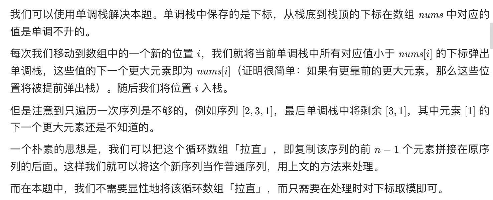

= 下一个更大元素 II
:toc:
:toclevels: 5
:sectnums:
:toc-title:

== 说明
给定一个循环数组（最后一个元素的下一个元素是数组的第一个元素），输出每个元素的下一个更大元素。数字 x 的下一个更大的元素是按数组遍历顺序，这个数字之后的第一个比它更大的数，这意味着你应该循环地搜索它的下一个更大的数。如果不存在，则输出 -1。

示例 1:
```
输入: [1,2,1]
输出: [2,-1,2]
解释: 第一个 1 的下一个更大的数是 2；
数字 2 找不到下一个更大的数；
第二个 1 的下一个最大的数需要循环搜索，结果也是 2。
```
注意: 输入数组的长度不会超过 10000。

== 参考
- https://leetcode-cn.com/problems/next-greater-element-ii/

== 题解
=== 单调栈 + 循环数组


```go
func nextGreaterElements(nums []int) []int {
	n := len(nums)
	res := make([]int, n)
	for i := 0; i < n; i++ {
		res[i] = -1
	}
	stack := []int{}
	for i := 0; i < 2*n-1; i++ {
		for len(stack) > 0 && nums[stack[len(stack)-1]] < nums[i%n] {
			res[stack[len(stack)-1]] = nums[i%n]
			stack = stack[:len(stack)-1]
		}
		stack = append(stack, i%n)
	}
	return res
}
```

时间复杂度分析：

- 时间复杂度: O(n)，其中 n 是序列的长度。我们需要遍历该数组中每个元素最多 2 次，每个元素出栈与入栈的总次数也不超过 4 次。
- 空间复杂度: O(n)，其中 n 是序列的长度。空间复杂度主要取决于栈的大小，栈的大小至多为 2n-1。
