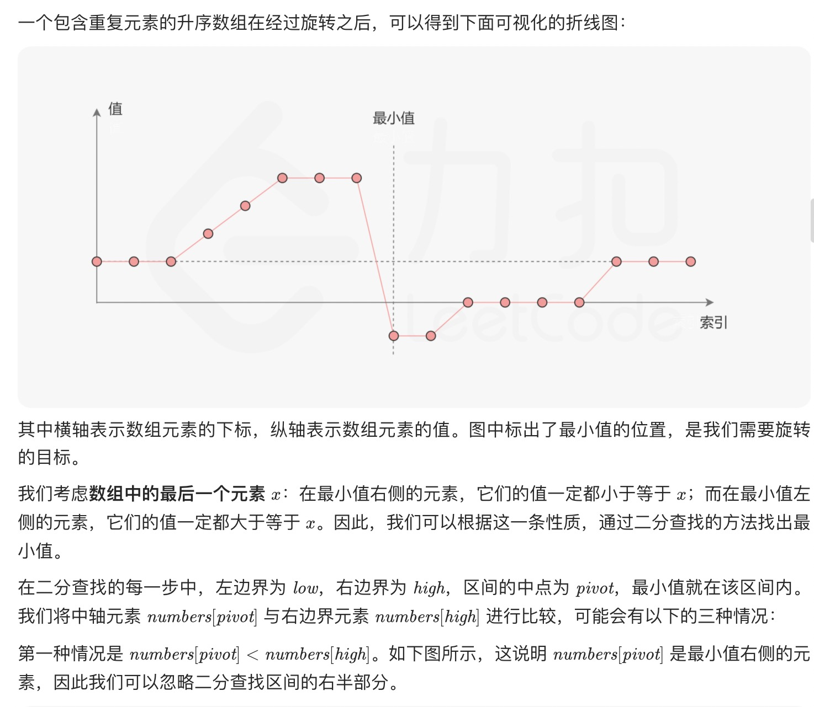
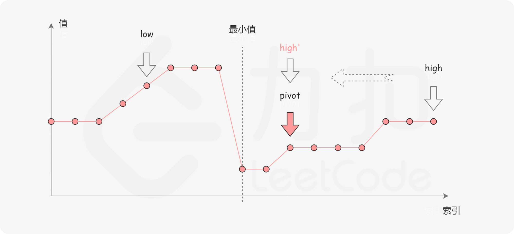
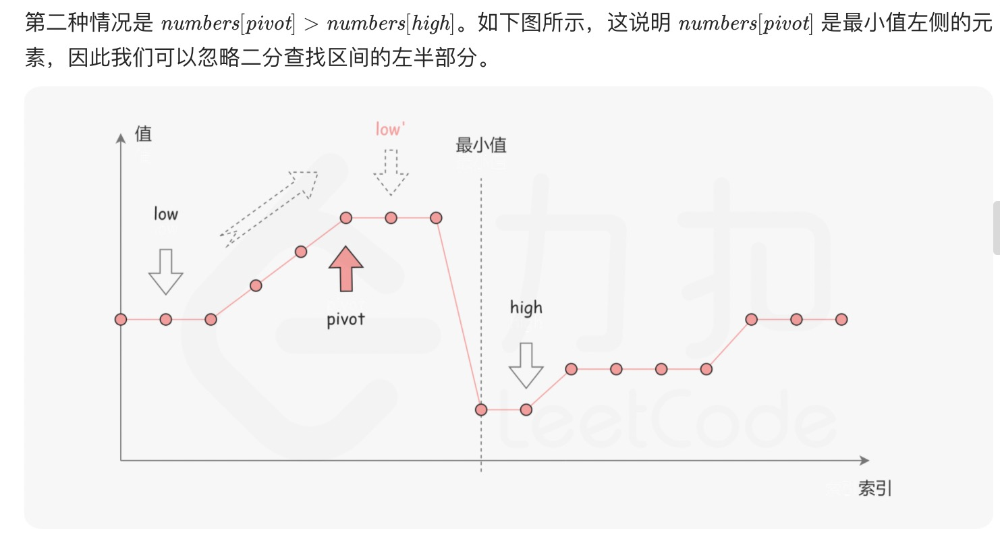
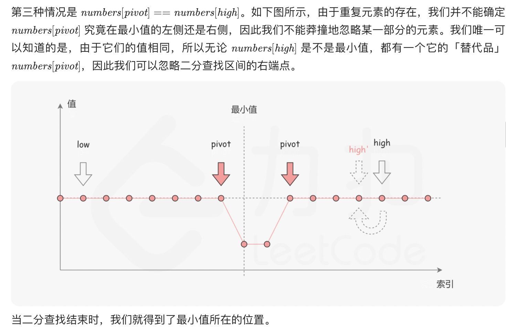

= 旋转数组的最小数字
:toc:
:toclevels: 5
:sectnums:
:toc-title:

== 说明
把一个数组最开始的若干个元素搬到数组的末尾，我们称之为数组的旋转。输入一个递增排序的数组的一个旋转，输出旋转数组的最小元素。例如，数组 [3,4,5,1,2] 为 [1,2,3,4,5] 的一个旋转，该数组的最小值为1。  

示例 1：

输入：[3,4,5,1,2]
输出：1
示例 2：

输入：[2,2,2,0,1]
输出：0

== 参考
- https://leetcode-cn.com/problems/xuan-zhuan-shu-zu-de-zui-xiao-shu-zi-lcof/

== 题解
=== 暴力法
一次循环寻找
```go
func minArray(numbers []int) int {
    minN := numbers[0]
    for i := 0 ; i < len(numbers) ; i ++ {
        if numbers[i] < minN {
            minN = numbers[i]
        }
    }
    return minN
}
```

=== 二分法









```go
func minArray(numbers []int) int {
    low, high := 0 , len(numbers) - 1
    for low < high {
        mid := (high + low) >> 1
        if numbers[mid] < numbers[high] {
            high = mid
        } else if numbers[mid] > numbers[high] {
            low = mid + 1
        } else {
            high --
        }
    }
    return numbers[low]
}
```

复杂度分析

- 时间复杂度：平均时间复杂度为 O(logn)，其中 n 是数组 numbers 的长度。如果数组是随机生成的，那么数组中包含相同元素的概率很低，在二分查找的过程中，大部分情况都会忽略一半的区间。而在最坏情况下，如果数组中的元素完全相同，那么 while 循环就需要执行 n 次，每次忽略区间的右端点，时间复杂度为 O(n)。
- 空间复杂度：O(1)。