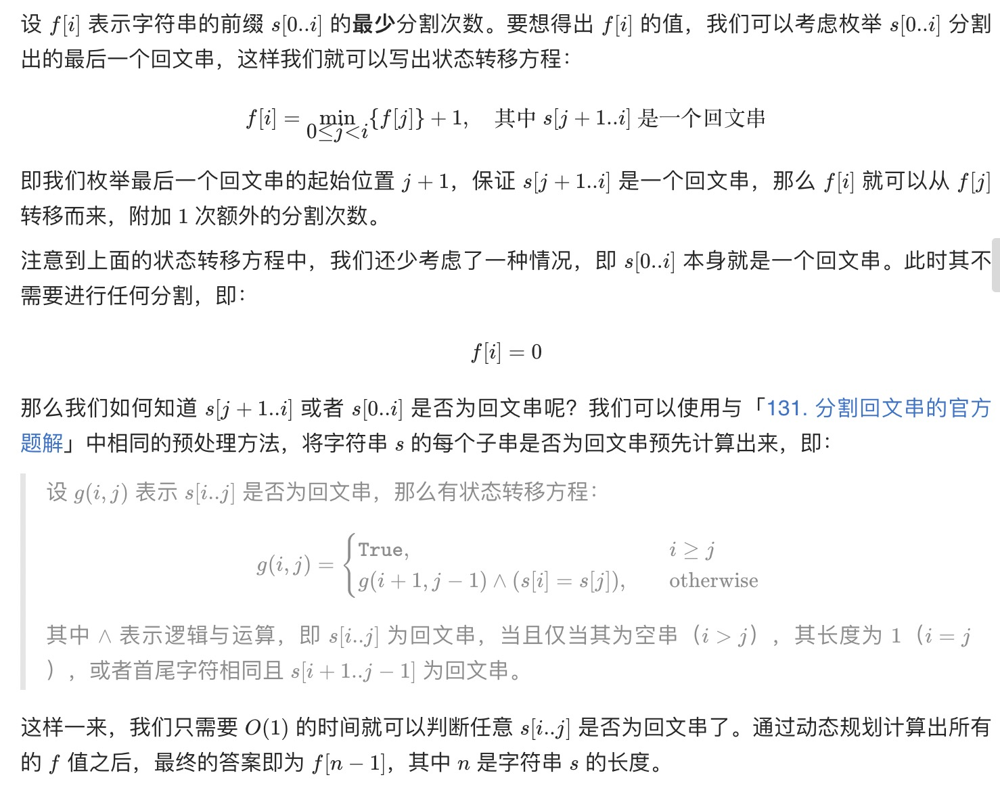

= 分割回文串 II
:toc:
:toclevels: 5
:sectnums:
:toc-title:


== 说明
给你一个字符串 s，请你将 s 分割成一些子串，使每个子串都是回文。

返回符合要求的 最少分割次数 。

 

示例 1：
```
输入：s = "aab"
输出：1
解释：只需一次分割就可将 s 分割成 ["aa","b"] 这样两个回文子串。
```
示例 2：
```
输入：s = "a"
输出：0
```
示例 3：
```
输入：s = "ab"
输出：1
```

== 参考
- https://leetcode-cn.com/problems/palindrome-partitioning-ii/

== 题解
=== 动态规划


```go

func minCut(s string) int {
	n := len(s)
	if n == 0 {
		return 0
	}
	g := make([][]bool, n)
	for i := 0; i < n; i++ {
		g[i] = make([]bool, n)
		for j := 0; j < n; j++ {
			g[i][j] = true
		}
	}
	for i := n - 1; i >= 0; i-- {
		for j := i + 1; j < n; j++ {
			g[i][j] = s[i] == s[j] && g[i+1][j-1]
		}
	}
	f := make([]int, n)
	for i := 0; i < n; i++ {
		if g[0][i] {
			continue
		}
		f[i] = math.MaxInt64
		for j := 0; j < i; j++ {
			if g[j+1][i] && f[j]+1 < f[i] {
				f[i] = f[j] + 1
			}
		}
	}
	return f[n-1]
}

```