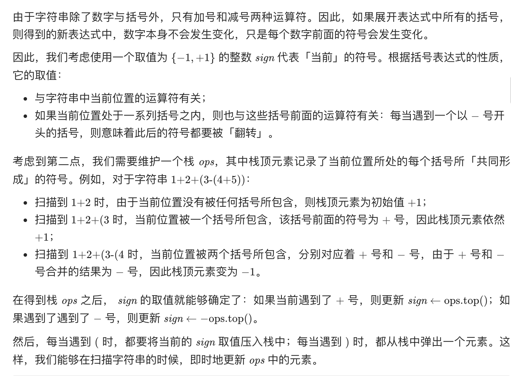

= 基本计算器
:toc:
:toclevels: 5
:sectnums:
:toc-title:

== 说明
实现一个基本的计算器来计算一个简单的字符串表达式 s 的值。

 

示例 1：
```
输入：s = "1 + 1"
输出：2
```
示例 2：
```
输入：s = " 2-1 + 2 "
输出：3
```
示例 3：
```
输入：s = "(1+(4+5+2)-3)+(6+8)"
输出：23
```
提示：
```
1 <= s.length <= 3 * 105
s 由数字、'+'、'-'、'('、')'、和 ' ' 组成
s 表示一个有效的表达式
```
== 参考
- https://leetcode-cn.com/problems/basic-calculator/

== 题解
=== 栈


```go
func calculate(s string) (ans int) {
	ops := []int{1}
	sign := 1
	n := len(s)
	for i := 0; i < n; {
		switch s[i] {
		case ' ':
			i++
		case '+':
			sign = ops[len(ops)-1]
			i++
		case '-':
			sign = -ops[len(ops)-1]
			i++
		case '(':
			ops = append(ops, sign)
			i++
		case ')':
			ops = ops[:len(ops)-1]
			i++
		default:
			num := 0
			for ; i < n && '0' <= s[i] && s[i] <= '9'; i++ {
				num = num*10 + int(s[i]-'0')
			}
			ans += sign * num
		}
	}
	return
}
```
