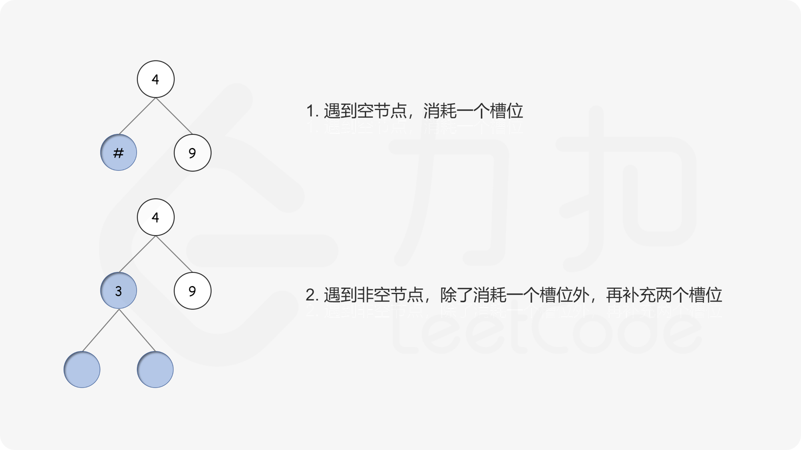

= 验证二叉树的前序序列化
:toc:
:toclevels: 5
:sectnums:
:toc-title:

== 说明
序列化二叉树的一种方法是使用前序遍历。当我们遇到一个非空节点时，我们可以记录下这个节点的值。如果它是一个空节点，我们可以使用一个标记值记录，例如 #。
```
     _9_
    /   \
   3     2
  / \   / \
 4   1  #  6
/ \ / \   / \
# # # #   # #
```
例如，上面的二叉树可以被序列化为字符串 "9,3,4,#,#,1,#,#,2,#,6,#,#"，其中 # 代表一个空节点。

给定一串以逗号分隔的序列，验证它是否是正确的二叉树的前序序列化。编写一个在不重构树的条件下的可行算法。

每个以逗号分隔的字符或为一个整数或为一个表示 null 指针的 '#' 。

你可以认为输入格式总是有效的，例如它永远不会包含两个连续的逗号，比如 "1,,3" 。

示例 1:
```
输入: "9,3,4,#,#,1,#,#,2,#,6,#,#"
输出: true
```
示例 2:
```
输入: "1,#"
输出: false
```
示例 3:
```
输入: "9,#,#,1"
输出: false
```

== 参考
- https://leetcode-cn.com/problems/verify-preorder-serialization-of-a-binary-tree/

== 题解

=== 栈
我们可以定义一个概念，叫做槽位。一个槽位可以被看作「当前二叉树中正在等待被节点填充」的那些位置。

二叉树的建立也伴随着槽位数量的变化。每当遇到一个节点时：

- 如果遇到了空节点，则要消耗一个槽位；
- 如果遇到了非空节点，则除了消耗一个槽位外，还要再补充两个槽位。

此外，还需要将根节点作为特殊情况处理。



我们使用栈来维护槽位的变化。栈中的每个元素，代表了对应节点处剩余槽位的数量，而栈顶元素就对应着下一步可用的槽位数量。当遇到空节点时，仅将栈顶元素减 1；当遇到非空节点时，将栈顶元素减 1 后，再向栈中压入一个 2。无论何时，如果栈顶元素变为 0，就立刻将栈顶弹出。

遍历结束后，若栈为空，说明没有待填充的槽位，因此是一个合法序列；否则若栈不为空，则序列不合法。此外，在遍历的过程中，若槽位数量不足，则序列不合法。

```go
func isValidSerialization(preorder string) bool {
    n := len(preorder)
    stk := []int{1}
    for i := 0; i < n; {
        if len(stk) == 0 {
            return false
        }
        if preorder[i] == ',' {
            i++
        } else if preorder[i] == '#' {
            stk[len(stk)-1]--
            if stk[len(stk)-1] == 0 {
                stk = stk[:len(stk)-1]
            }
            i++
        } else {
            // 读一个数字
            for i < n && preorder[i] != ',' {
                i++
            }
            stk[len(stk)-1]--
            if stk[len(stk)-1] == 0 {
                stk = stk[:len(stk)-1]
            }
            stk = append(stk, 2)
        }
    }
    return len(stk) == 0
}

```

复杂度分析

- 时间复杂度：O(n)，其中 n 为字符串的长度。我们每个字符只遍历一次，同时每个字符对应的操作都是常数时间的。
- 空间复杂度：O(n)。此为栈所需要使用的空间。


=== 计数
我们可以只维护一个计数器，代表栈中所有元素之和，其余的操作逻辑均可以保持不变。

```go
func isValidSerialization(preorder string) bool {
    n := len(preorder)
    m := 1
    for i := 0 ; i < n ; {
        if m == 0 {
            return false
        }
        if preorder[i] == ',' {
            i ++
        } else if preorder[i] == '#' {
            m --
            i ++
        } else {
            for i < n && preorder[i] != ',' {
                i ++
            }
            m ++
        }
    }
    return m == 0
}
```
