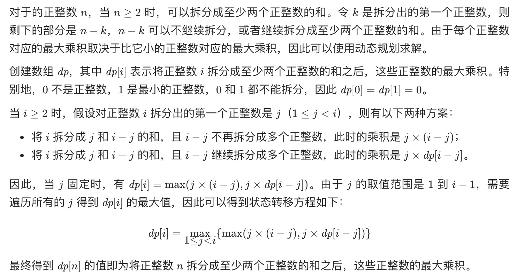
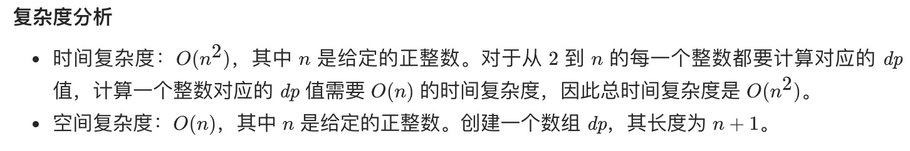

= 整数拆分
:toc:
:toclevels: 5
:sectnums:
:toc-title:

== 说明
给定一个正整数 n，将其拆分为至少两个正整数的和，并使这些整数的乘积最大化。 返回你可以获得的最大乘积。

示例 1:
```
输入: 2
输出: 1
解释: 2 = 1 + 1, 1 × 1 = 1。
```
示例 2:
```
输入: 10
输出: 36
解释: 10 = 3 + 3 + 4, 3 × 3 × 4 = 36。
```
说明: 你可以假设 n 不小于 2 且不大于 58。

== 参考
- https://leetcode-cn.com/problems/integer-break/

== 题解
=== 动态规划



```go
func integerBreak(n int) int {
    dp := make([]int, n+1)
    for i := 2 ; i <= n ; i ++ {
        curMax := 0
        for j := 1 ; j < i ; j ++ {
            curMax = max(curMax, max(j * (i -j), j * dp[i-j]))
        }
        dp[i] = curMax
    }
    return dp[n]
}

func max(x,y int) int {
    if x > y {
        return x
    }
    return y
}
```

```python
class Solution:
    def integerBreak(self, n: int) -> int:
        dp = [0] * (n+1)
        for i in range(2, n+1) :
            curmax = 0
            for j in range(1, i) :
                curmax = max(curmax, j * (i - j), j * dp[i-j])
            dp[i] = curmax
        return dp[n]
```

