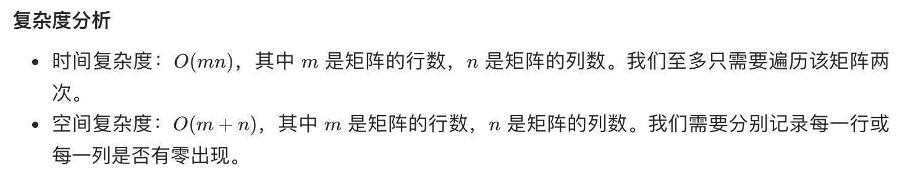

= 矩阵置零
:toc:
:toclevels: 5
:sectnums:
:toc-title:

== 说明
给定一个 m x n 的矩阵，如果一个元素为 0 ，则将其所在行和列的所有元素都设为 0 。请使用 原地 算法。

进阶：

- 一个直观的解决方案是使用  O(mn) 的额外空间，但这并不是一个好的解决方案。
- 一个简单的改进方案是使用 O(m + n) 的额外空间，但这仍然不是最好的解决方案。
- 你能想出一个仅使用常量空间的解决方案吗？

示例 1：

```
输入：matrix = [[1,1,1],[1,0,1],[1,1,1]]
输出：[[1,0,1],[0,0,0],[1,0,1]]
```
示例 2：
```

输入：matrix = [[0,1,2,0],[3,4,5,2],[1,3,1,5]]
输出：[[0,0,0,0],[0,4,5,0],[0,3,1,0]]
```

== 参考
- https://leetcode-cn.com/problems/set-matrix-zeroes/

== 题解
=== 使用标记数组


```go
func setZeroes(matrix [][]int) {
    row := make([]bool, len(matrix))
    col := make([]bool, len(matrix[0]))
    for i, r := range matrix {
        for j, v := range r {
            if v == 0 {
                row[i] = true
                col[j] = true
            }
        }
    }
    for i, r := range matrix {
        for j := range r {
            if row[i] || col[j] {
                r[j] = 0
            }
        }
    }
}

```



=== 使用两个标记变量

