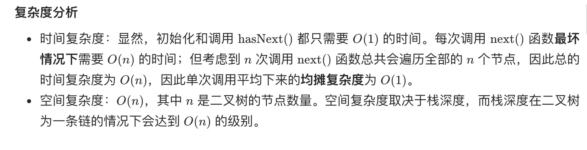

= 二叉搜索树迭代器
:toc:
:toclevels: 5
:sectnums:
:toc-title:

== 说明
实现一个二叉搜索树迭代器类BSTIterator ，表示一个按中序遍历二叉搜索树（BST）的迭代器：

- BSTIterator(TreeNode root) 初始化 BSTIterator 类的一个对象。BST 的根节点 root 会作为构造函数的一部分给出。指针应初始化为一个不存在于 BST 中的数字，且该数字小于 BST 中的任何元素。
- boolean hasNext() 如果向指针右侧遍历存在数字，则返回 true ；否则返回 false 。
- int next()将指针向右移动，然后返回指针处的数字。

注意，指针初始化为一个不存在于 BST 中的数字，所以对 next() 的首次调用将返回 BST 中的最小元素。

你可以假设 next() 调用总是有效的，也就是说，当调用 next() 时，BST 的中序遍历中至少存在一个下一个数字。

示例：

image:images/bst-tree.png[]

```
输入
["BSTIterator", "next", "next", "hasNext", "next", "hasNext", "next", "hasNext", "next", "hasNext"]
[[[7, 3, 15, null, null, 9, 20]], [], [], [], [], [], [], [], [], []]
输出
[null, 3, 7, true, 9, true, 15, true, 20, false]

解释
BSTIterator bSTIterator = new BSTIterator([7, 3, 15, null, null, 9, 20]);
bSTIterator.next();    // 返回 3
bSTIterator.next();    // 返回 7
bSTIterator.hasNext(); // 返回 True
bSTIterator.next();    // 返回 9
bSTIterator.hasNext(); // 返回 True
bSTIterator.next();    // 返回 15
bSTIterator.hasNext(); // 返回 True
bSTIterator.next();    // 返回 20
bSTIterator.hasNext(); // 返回 False
``

提示：
```
树中节点的数目在范围 [1, 105] 内
0 <= Node.val <= 106
最多调用 105 次 hasNext 和 next 操作


进阶：
```
你可以设计一个满足下述条件的解决方案吗？next() 和 hasNext() 操作均摊时间复杂度为 O(1) ，并使用 O(h) 内存。其中 h 是树的高度。
```


== 参考
- https://leetcode-cn.com/problems/binary-search-tree-iterator/

== 题解
=== 递归
我们可以直接对二叉搜索树做一次完全的递归遍历，获取中序遍历的全部结果并保存在数组中。随后，我们利用得到的数组本身来实现迭代器。

```go

type TreeNode struct {
	Val   int
	Left  *TreeNode
	Right *TreeNode
}

type BSTIterator struct {
	l []int
}

func Constructor(root *TreeNode) BSTIterator {
	l := getVals(root)
	return BSTIterator{l: l}
}

func (this *BSTIterator) Next() int {
	x := this.l[0]
	this.l = this.l[1:len(this.l)]
	return x
}

func (this *BSTIterator) HasNext() bool {
	return len(this.l) > 0
}

func getVals(root *TreeNode) []int {
	res := []int{}
	if root == nil {
		return res
	}
	res = append(res, getVals(root.Left)...)
	res = append(res, root.Val)
	res = append(res, getVals(root.Right)...)
	return res
}


```

复杂度分析

- 时间复杂度：初始化需要 O(n) 的时间，其中 n 为树中节点的数量。随后每次调用只需要 O(1) 的时间。
- 空间复杂度：O(n)，因为需要保存中序遍历的全部结果。

=== 迭代
除了递归的方法外，我们还可以利用栈这一数据结构，通过迭代的方式对二叉树做中序遍历。此时，我们无需预先计算出中序遍历的全部结果，只需要实时维护当前栈的情况即可。

```go

type TreeNode struct {
	Val   int
	Left  *TreeNode
	Right *TreeNode
}

type BSTIterator struct {
	stack []*TreeNode
	cur   *TreeNode
}

func Constructor(root *TreeNode) BSTIterator {
	return BSTIterator{cur: root}
}

func (this *BSTIterator) Next() int {
	for node := this.cur; node != nil; node = node.Left {
		this.stack = append(this.stack, node)
	}
	this.cur = this.stack[len(this.stack)-1]
	this.stack = this.stack[:len(this.stack)-1]
	val := this.cur.Val
	this.cur = this.cur.Right
	return val
}

func (this *BSTIterator) HasNext() bool {
	return this.cur != nil || len(this.stack) > 0
}

```



