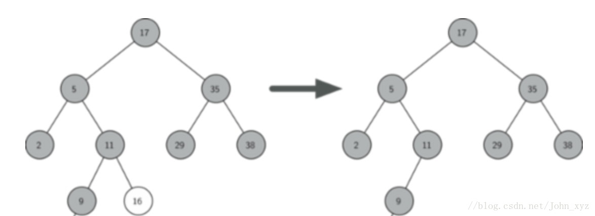
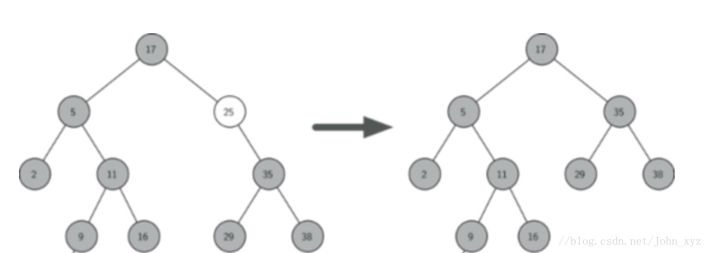
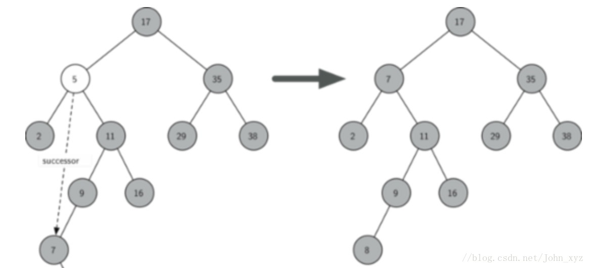

= 二叉搜索树（BST）
:toc: right
:toc-title: 目录

== 定义及特点

二叉查找树（英语：Binary Search Tree），也称为 二叉搜索树、有序二叉树（Ordered Binary Tree）或排序二叉树（Sorted Binary Tree），是指一棵空树或者具有下列性质的二叉树：

- 若任意节点的左子树不空，则左子树上所有节点的值均小于它的根节点的值；
- 若任意节点的右子树不空，则右子树上所有节点的值均大于它的根节点的值；
- 任意节点的左、右子树也分别为二叉查找树；
- 没有键值相等的节点。

二叉查找树相比于其他数据结构的优势在于查找、插入的时间复杂度较低。为 O(logn)。二叉查找树是基础性数据结构，用于构建更为抽象的数据结构，如集合、多重集、关联数组等。

二叉查找树的查找过程和次优二叉树类似，通常采取二叉链表作为二叉查找树的存储结构。中序遍历二叉查找树可得到一个关键字的有序序列，一个无序序列可以通过构造一棵二叉查找树变成一个有序序列，构造树的过程即为对无序序列进行查找的过程。每次插入的新的结点都是二叉查找树上新的叶子结点，在进行插入操作时，不必移动其它结点，只需改动某个结点的指针，由空变为非空即可。搜索、插入、删除的复杂度等于树高，期望 O(\log n)O(logn)，最坏 O(n)O(n)（数列有序，树退化成线性表）。

image:images/Binary_search_tree.svg[]


虽然二叉查找树的最坏效率是 O(n)O(n)，但它支持动态查询，且有很多改进版的二叉查找树可以使树高为 O(\log n)O(logn)，从而将最坏效率降至 O(\log n)O(logn)，如 AVL 树、红黑树等。


== 常用操作
=== 树节点定义:
```python
class TreeNode:
    def __init__(self, val):
        self.val = val
        self.left = None
        self.right = None
```

or

```go
type TreeNode struct {
	Val   int
	Left  *TreeNode
	Right *TreeNode
}
```

=== 查找
在二叉搜索树b中查找x的过程为：

- 若b是空树，则搜索失败，否则：
- 若x等于b的根节点的数据域之值，则查找成功；否则：
- 若x小于b的根节点的数据域之值，则递归搜索左子树；否则:
- 递归查找右子树

=== 插入
向一个二叉搜索树b中插入一个节点s的算法，过程为：

- 若b是空树，则将s所指结点作为根节点插入，否则：
- 若s.val等于b的根节点的数据域之值，则返回，否则：
- 若s.val小于b的根节点的数据域之值，则把s所指节点插入到左子树中，否则：
- 把s所指节点插入到右子树中（新插入节点总是叶子节点）

=== 删除
二叉搜索树的删除操作分三种情况讨论:

- 如果待删除的节点是叶子节点，那么可以立即被删除，如下图所示：
例：删除数据为16的节点，是叶子节点，可以直接删除



- 如果有一个子节点，要将下一个子节点上移到当前节点，即替换之
例：删除数据为25的节点，它下面有唯一一个子节点35, 上移到替换之



- 如果有两个子节点，则将其右子树的最小数据代替此节点的数据，并将其右子树的最小数据删除，如下图所示
例：删除节点数据为5的节点，找到被删除节点右子树的最小节点。需要一个临时变量successor，将11节点下面的子节点进行查询，找到右子树最小节点7，并把右子树最小节点7替换被删除节点，维持二叉树结构。如下图



=== 遍历
可以采用前序，中序，后序来遍历该二叉搜索树，或者使用广度优先搜索的方式。这里用中序遍历来实现，可以保证按从小到大的顺序打印。

=== 构造一颗二叉查找树
用一组数值建造一棵二叉查找树的同时，也把这组数值进行了排序。其最差时间复杂度为 O(n2)。例如，若该组数值经是有序的（从小到大），则建造出来的二叉查找树的所有节点，都没有左子树


== 常用操作的实现
- python版: link:bst.py[]
- golang版: link:bst.go[]

== 性能分析
查找：最佳情况Olog(n), 最坏情况O(n)
插入：最佳情况Olog(n), 最坏情况O(n)
删除：最佳情况Olog(n), 最坏情况O(n)
