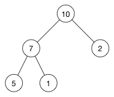

= 堆操作

== 堆属性

堆分为两种：最大堆和最小堆，两者的差别在于节点的排序方式。

在最大堆中，父节点的值比每一个子节点的值都要大。在最小堆中，父节点的值比每一个子节点的值都要小。这就是所谓的“堆属性”，并且这个属性对堆中的每一个节点都成立。

参见:



这是一个最大堆，，因为每一个父节点的值都比其子节点要大。10 比 7 和 2 都大。7 比 5 和 1都大。

根据这一属性，那么最大堆总是将其中的最大值存放在树的根节点。而对于最小堆，根节点中的元素总是树中的最小值。堆属性非常的有用，因为堆常常被当做优先队列使用，因为可以快速的访问到“最重要”的元素。

> 注意：堆的根节点中存放的是最大或者最小元素，但是其他节点的排序顺序是未知的。例如，在一个最大堆中，最大的那一个元素总是位于 index 0 的位置，但是最小的元素则未必是最后一个元素。--唯一能够保证的是最小的元素是一个叶节点，但是不确定是哪一个。

== 来自数组的数
用数组来实现树相关的数据结构也许看起来有点古怪，但是它在时间和空间上都是很高效的。

我们准备将上面的例子中的树这样存储：

如果我们不允许使用指针，那么我们怎么知道哪一个节点是父节点，哪一个节点是它的子节点呢？问得好！节点在数组中的位置index 和它的父节点已经子节点的索引之间有一个映射关系。

如果 i 是节点的索引，那么下面的公式就给出了它的父节点和子节点在数组中的位置：
```
parent(i) = floor((i - 1)/2)
left(i)   = 2i + 1
right(i)  = 2i + 2
```
>- 注意 right(i) 就是简单的 left(i) + 1。左右节点总是处于相邻的位置。

== 可以用堆做什么
有两个原始操作用于保证插入或删除节点以后堆是一个有效的最大堆或者最小堆：

- shiftUp(): 如果一个节点比它的父节点大（最大堆）或者小（最小堆），那么需要将它同父节点交换位置。这样是这个节点在数组的位置上升。
- shiftDown(): 如果一个节点比它的子节点小（最大堆）或者大（最小堆），那么需要将它向下移动。这个操作也称作“堆化（heapify）”。

shiftUp 或者 shiftDown 是一个递归的过程，所以它的时间复杂度是 O(log n)。

基于这两个原始操作还有一些其他的操作：

- insert(value): 在堆的尾部添加一个新的元素，然后使用 shiftUp 来修复对。
- remove(): 移除并返回最大值（最大堆）或者最小值（最小堆）。为了将这个节点删除后的空位填补上，需要将最后一个元素移到根节点的位置，然后使用 shiftDown 方法来修复堆。
- removeAtIndex(index): 和 remove() 一样，差别在于可以移除堆中任意节点，而不仅仅是根节点。当它与子节点比较位置不时无序时使用 shiftDown()，如果与父节点比较发现无序则使用 shiftUp()。
- replace(index, value)：将一个更小的值（最小堆）或者更大的值（最大堆）赋值给一个节点。由于这个操作破坏了堆属性，所以需要使用 shiftUp() 来修复堆属性。

上面所有的操作的时间复杂度都是 O(log n)，因为 shiftUp 和 shiftDown 都很费时。还有少数一些操作需要更多的时间：

- search(value):堆不是为快速搜索而建立的，但是 replace() 和 removeAtIndex() 操作需要找到节点在数组中的index，所以你需要先找到这个index。时间复杂度：O(n)。
- buildHeap(array):通过反复调用 insert() 方法将一个（无序）数组转换成一个堆。如果你足够聪明，你可以在 O(n) 时间内完成。
- 堆排序：由于堆就是一个数组，我们可以使用它独特的属性将数组从低到高排序。时间复杂度：O(n lg n)。
