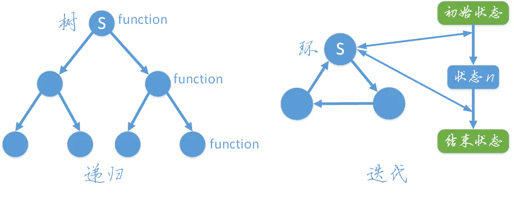

= 迭代
:toc:
:toc-title: 目录
:toclevels: 5
:sectnums:


== 迭代原理
重复反馈过程的活动，每一次迭代的结果会作为下一次迭代的初始值。（A重复调用B）

== 例子

用递归的方法反转单链表

```go
func reverseList_items(head *ListNode) *ListNode {
    if head == nil {
        return nil
    }
    // 初始化一个空节点
    var pre *ListNode = nil
    current := head
    for current != nil {
        tmp := current.Next
        current.Next = pre
        pre = current
        current = tmp
    }
    return pre
}
```


== 迭代与递归的比较
递归是一个树结构，从字面可以其理解为重复“递推”和“回归”的过程，当“递推”到达底部时就会开始“回归”，其过程相当于树的深度优先遍历。

迭代是一个环结构，从初始状态开始，每次迭代都遍历这个环，并更新状态，多次迭代直到到达结束状态。



用 `斐波拉契` 数组演示一下两个的算法

=== 迭代

```go

func Fibonacci_items(n int) int {
	a := 0
	b := 1
	for i := 0; i < n; i++ {
		c := a + b
		a = b
		b = c
	}
	return a
}
```

=== 递归
```go

func Fibonacci_items(n int) int {
	if n == 1 || n == 2 {
		return 1
	}
	z := Fibonacci_items(n-1) + Fibonacci_items(n-2)
	return z
}

```