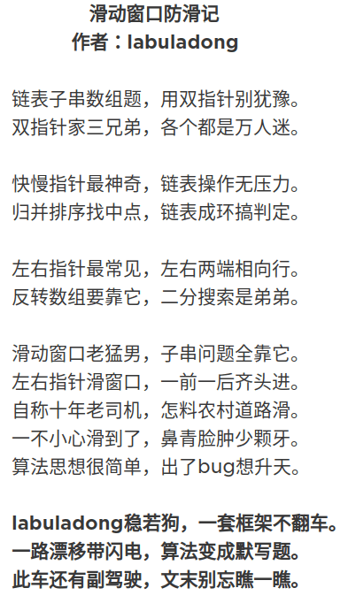

= slide Window 滑动窗口
:toc: right
:toc-title: 目录
:toclevels: 5
:sectnums:

== 说明

== 参考
https://leetcode-cn.com/problems/minimum-window-substring/solution/hua-dong-chuang-kou-suan-fa-tong-yong-si-xiang-by-/

== 框架



```
void slidingWindow(string s, string t) {
    unordered_map<char, int> need, window;
    for (char c : t) need[c]++;

    int left = 0, right = 0;
    int valid = 0;
    while (right < s.size()) {
        // c 是将移入窗口的字符
        char c = s[right];
        // 右移窗口
        right++;
        // 进行窗口内数据的一系列更新
        ...

        /*** debug 输出的位置 ***/
        printf("window: [%d, %d)\n", left, right);
        /********************/

        // 判断左侧窗口是否要收缩
        while (window needs shrink) {
            // d 是将移出窗口的字符
            char d = s[left];
            // 左移窗口
            left++;
            // 进行窗口内数据的一系列更新
            ...
        }
    }
}

```

